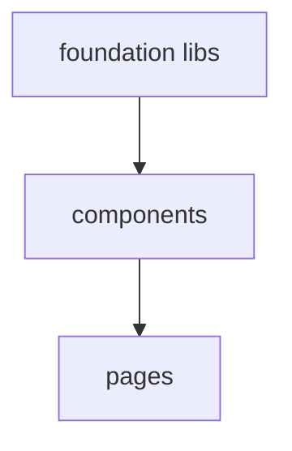
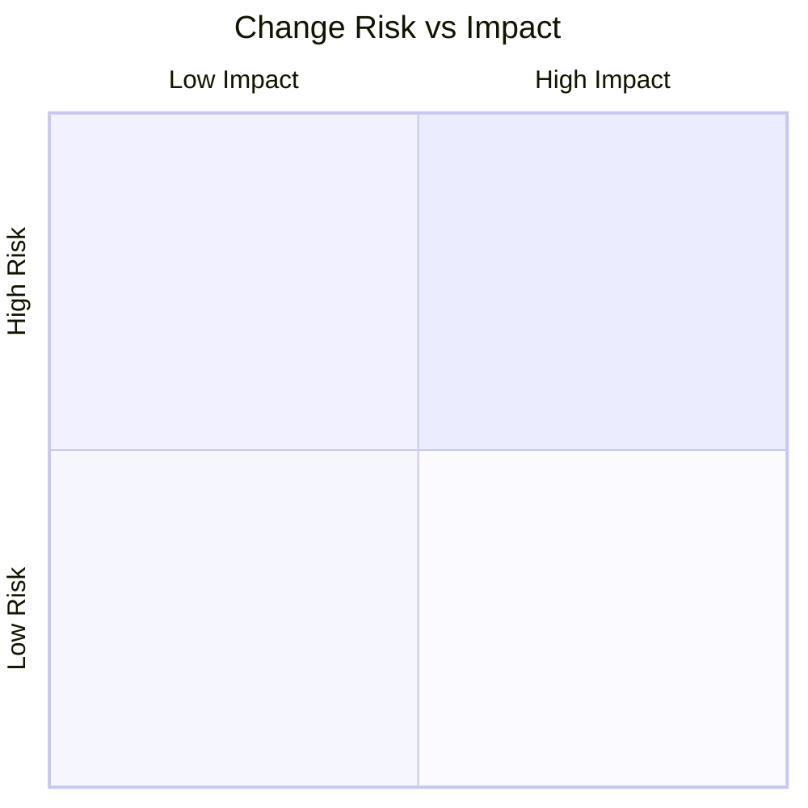

<!--
  CommonGrid Pull Request Description Standard v1.0
  ──────────────────────────────────────────────────
  This template defines the canonical PR description format for the CommonGrid project.
  It is designed to be:
    • Routinely producible — sections can be generated via `scripts/pr-describe.sh`
    • Attestable — reviewers check boxes to confirm analysis was reviewed
    • Extensible — optional sections can be included/omitted per author discretion
    • Machine-readable — structured tables and mermaid diagrams for tooling

  USAGE:
    Required sections:  Summary, Changeset Overview, Test Plan
    Recommended:        Impact Analysis, Risk Assessment, Commit Table
    Optional:           Architecture Diagrams, Responsive Audit, Deferred Work

  Section markers use HTML comments for collapse/expand and tooling hooks.
-->

## Summary
<!-- 1-3 sentences. What changed and why. Link related issues. -->

## Motivation
<!-- What problem does this solve? Who benefits? Link to issue/discussion if applicable. -->

## Changeset Overview
<!-- Auto-generated or manually composed. Use `git diff --stat` as baseline. -->

| Metric | Value |
|--------|-------|
| Commits | |
| Files changed | |
| Insertions | |
| Deletions | |
| Net | |

## Commit Log
<!-- Conventional Commit format. Classify by type/scope/magnitude. -->

| Hash | Type | Scope | Description | Size | Risk |
|------|------|-------|-------------|------|------|
| | | | | | |

<strong>Commit Classification Key</strong>

- **Type**: `feat` | `fix` | `style` | `refactor` | `test` | `docs` | `chore`
- **Size**: `S` (<20 lines) | `M` (20-80 lines) | `L` (>80 lines)
- **Risk**: `low` (additive/isolated) | `medium` (cross-cutting/visual) | `high` (behavioral/breaking)

## File Impact Matrix
<!-- Categorize each file by layer and change character. -->

| File | Layer | +/- | Character |
|------|-------|-----|-----------|
| | | | |

<strong>Layer & Character Key</strong>

- **Layer**: `page` | `component` | `lib` | `style` | `asset` | `config` | `type` | `test`
- **Character**: _Major feature_ | _New columns/fields_ | _Style-only_ | _Bug fix_ | _Metadata_ | _Refactor_

## Architecture & Dependency
<!-- Mermaid diagram showing file dependencies and review ordering. -->

## Impact Analysis

### Component Touch Map
<!-- Which components were modified? Show render hierarchy. -->

### Responsive Breakpoint Audit
<!-- What changed at each viewport threshold? -->

| Breakpoint | Changes |
|------------|---------|
| `< sm` (640px) | |
| `< md` (768px) | |
| `≥ lg` (1024px) | |
| All viewports | |

### CSS / Tailwind Delta
<!-- Notable class additions, removals, or replacements. -->

## Risk Assessment

### Regression Risk Matrix
<!-- Classify changes by regression likelihood. -->

| Change | Risk | Blast Radius | Mitigation |
|--------|------|-------------|------------|
| | | | |

## Deferred Work
<!-- What was explicitly out-of-scope? Link to follow-up issues. -->

- [ ] _Item_ — rationale for deferral

## Test Plan
<!-- How was this tested? What should reviewers verify? -->

- [ ] Visual regression check at 320px, 768px, 1440px viewports
- [ ] Dark mode / light mode toggle
- [ ] Navigation flow (all pages load, links resolve)
- [ ] CMD+K search opens and returns results
- [ ] Map loads and resizes on layout switch

## Reviewer Checklist
<!-- Reviewers: check each box after confirming. -->

- [ ] Changeset overview matches actual diff
- [ ] Risk assessment reviewed and agreed
- [ ] No secrets, credentials, or .env values committed
- [ ] Responsive behavior verified at stated breakpoints
- [ ] Accessibility: focus order, aria labels, contrast ratios

## Screenshots / Recordings
<!-- Before/after at key breakpoints. Attach or link. -->

| Viewport | Before | After |
|----------|--------|-------|
| Mobile (375px) | | |
| Tablet (768px) | | |
| Desktop (1440px) | | |
