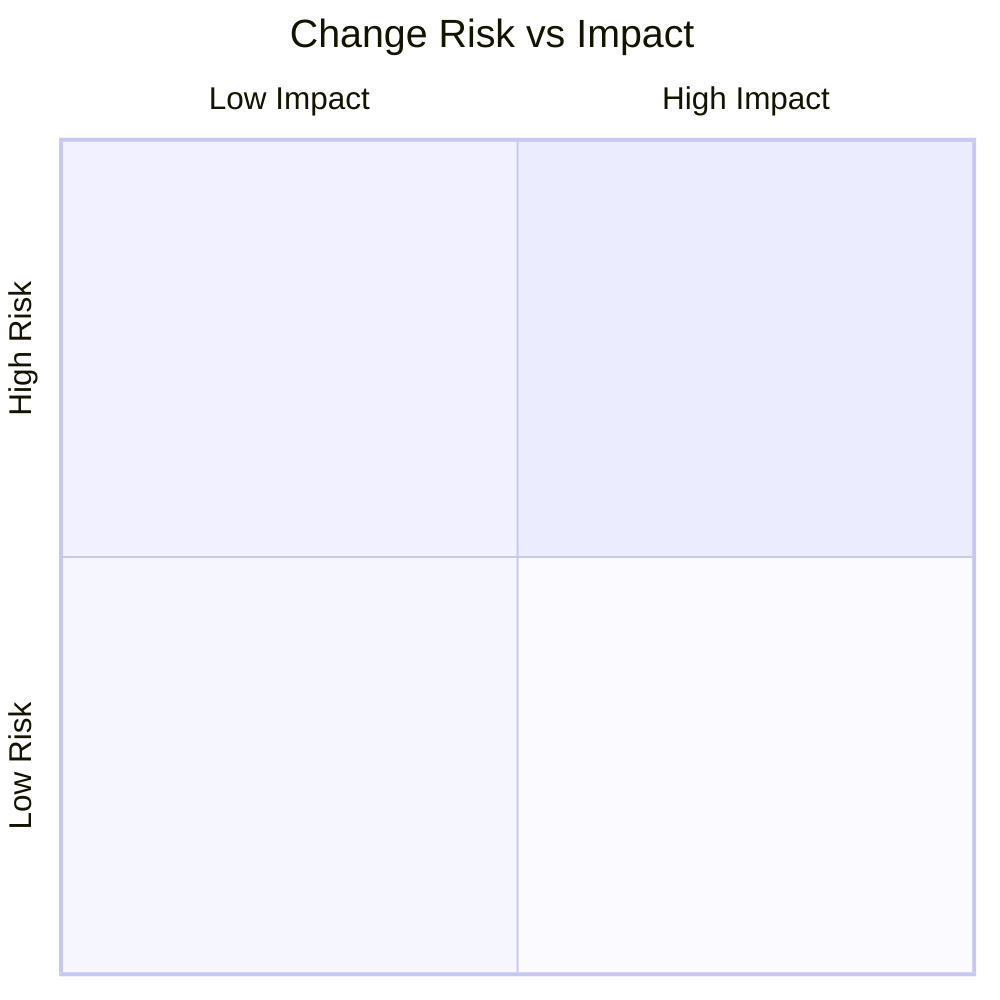
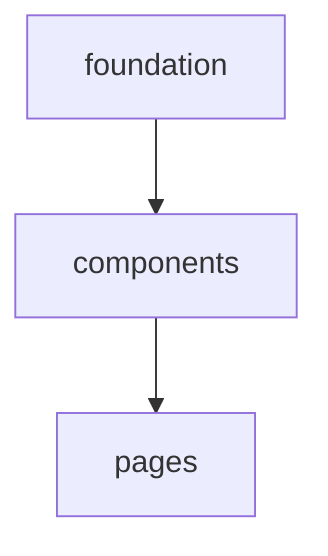

<!--
  CommonGrid Pull Request Description Standard v1.0
  ──────────────────────────────────────────────────
  Informed by: Kubernetes PR template, React PR template, Rust RFC process,
  Linux kernel cover-letter format, Conventional Commits v1.0, Keep a Changelog v1.1,
  MADR (Markdown ADR), CodeRabbit walkthrough format, and Graphite stacked-PR patterns.

  References:
    https://www.conventionalcommits.org/en/v1.0.0/
    https://keepachangelog.com/en/1.1.0/
    https://adr.github.io/
    https://github.com/kubernetes/kubernetes/blob/master/.github/PULL_REQUEST_TEMPLATE.md

  Design principles:
    • Routinely producible — sections map to `git diff`, `git log`, and linter output
    • Attestable — reviewers check boxes to confirm analysis was reviewed
    • Extensible — optional sections can be included/omitted per author discretion
    • Machine-readable — structured tables, Mermaid diagrams, HTML comment hooks
    • Multi-persona scannable — TL;DR for maintainers, detail for domain experts,
      collapsible sections for new contributors

  USAGE:
    Required sections:  Summary, Change Type, Changeset Overview, Test Plan
    Recommended:        Commit Log, File Impact Matrix, Risk Assessment
    Optional:           Architecture Diagrams, Responsive Audit, ADR Context,
                        Deferred Work, Screenshots

  PR TITLE FORMAT (Conventional Commits):
    <type>(<scope>): <description>
    e.g., feat(tables): add sort-direction chevrons and jurisdiction highlighting

  SECTION TIERS:
    [R] = Required — must be filled before review
    [+] = Recommended — include unless trivially small PR
    [~] = Optional — include when relevant to the change type
-->

<!-- ═══════════════════════════════════════════════════════════════════ -->
<!-- [R] REQUIRED SECTIONS                                              -->
<!-- ═══════════════════════════════════════════════════════════════════ -->

## Summary
<!-- [R] 1-3 sentences. What changed and why. This is the TL;DR. -->
<!-- Reviewers should understand the PR from this section alone. -->


## Change Type
<!-- [R] Check all that apply. Maps to Conventional Commit types. -->

- [ ] `feat` — New feature or capability
- [ ] `fix` — Bug fix
- [ ] `style` — Visual/CSS changes (no logic change)
- [ ] `refactor` — Code restructuring (no behavior change)
- [ ] `docs` — Documentation only
- [ ] `test` — Adding or modifying tests
- [ ] `chore` — Build, CI, dependency, or tooling changes
- [ ] `perf` — Performance improvement

**User-facing change?** <!-- yes / no -->
**Breaking change?** <!-- yes / no — if yes, describe in Motivation -->

## Changeset Overview
<!-- [R] Auto-generatable via: git diff --stat main...HEAD | tail -1 -->

| Metric | Value |
|--------|-------|
| Commits | |
| Files changed | |
| Insertions (+) | |
| Deletions (−) | |
| Net | |
| PR size | <!-- XS (<10) · S (10-100) · M (100-300) · L (300-500) · XL (500+) --> |

## Test Plan
<!-- [R] Most important section (per React PR template convention). -->
<!-- How was this tested? What should reviewers verify? Be specific. -->

### Automated
- [ ] `next build` / `npm run build` completes without errors
- [ ] Lint passes (e.g., `npx biome check`)

### Manual
- [ ] _Describe manual verification steps_

<!-- ═══════════════════════════════════════════════════════════════════ -->
<!-- [+] RECOMMENDED SECTIONS                                           -->
<!-- ═══════════════════════════════════════════════════════════════════ -->

## Motivation
<!-- [+] What problem does this solve? Who benefits? -->
<!-- Link to issue/discussion: Closes #, Fixes #, Relates to # -->
<!-- For architectural changes, consider ADR Context section below. -->


## Commit Log
<!-- [+] Conventional Commit format. Classify by type/scope/magnitude. -->

| Hash | Type | Scope | Description | Size | Risk |
|------|------|-------|-------------|------|------|
| | | | | | |

<details>
<summary><strong>Classification Key</strong></summary>

- **Type**: `feat` · `fix` · `style` · `refactor` · `test` · `docs` · `chore` · `perf`
- **Size**: `S` (<20 lines) · `M` (20-80 lines) · `L` (>80 lines)
- **Risk**: `low` (additive/isolated) · `medium` (cross-cutting/visual) · `high` (behavioral/breaking)
- Follows [Conventional Commits v1.0.0](https://www.conventionalcommits.org/en/v1.0.0/)

</details>

## File Impact Matrix
<!-- [+] Categorize each file by layer and change character. -->

| File | Layer | +/− | Character |
|------|-------|-----|-----------|
| | | | |

<details>
<summary><strong>Layer & Character Key</strong></summary>

- **Layer**: `page` · `component` · `lib` · `style` · `asset` · `config` · `type` · `test`
- **Character**: _Major feature_ · _New fields_ · _Style-only_ · _Bug fix_ · _Metadata_ · _Refactor_

</details>

## Risk Assessment
<!-- [+] Classify changes by regression likelihood and blast radius. -->

| Change | Risk | Blast Radius | Mitigation |
|--------|------|-------------|------------|
| | | | |

<!-- Optional: Mermaid risk-impact quadrant chart -->
<!--

-->

## Reviewer Checklist
<!-- [+] Reviewers: check each box after confirming. -->

- [ ] Changeset overview matches actual diff
- [ ] Risk assessment reviewed — no items should be elevated
- [ ] No secrets, credentials, or `.env` values committed
- [ ] Responsive behavior verified at stated breakpoints
- [ ] Accessibility: focus order, aria labels, contrast ratios preserved

<!-- ═══════════════════════════════════════════════════════════════════ -->
<!-- [~] OPTIONAL SECTIONS — include when relevant                      -->
<!-- ═══════════════════════════════════════════════════════════════════ -->

<!--
## Architecture & Dependency
[~] Mermaid diagram showing file dependencies and review ordering.
Use https://mermaid.live to prototype. Keep diagrams simple — complex
diagrams render poorly on GitHub.


-->

<!--
## Changelog
[~] Keep a Changelog categories. Use when PR includes user-facing changes.
https://keepachangelog.com/en/1.1.0/

### Added
-

### Changed
-

### Fixed
-

### Removed
-
-->

<!--
## Responsive Breakpoint Audit
[~] For UI PRs. What changed at each viewport threshold?

| Breakpoint | Changes |
|------------|---------|
| `< sm` (640px) | |
| `< md` (768px) | |
| `≥ lg` (1024px) | |
| All viewports | |
-->

<!--
## CSS / Tailwind Delta
[~] For style-heavy PRs. Notable class additions, removals, or replacements.

<details>
<summary>Classes Added</summary>

| Class | Where | Purpose |
|-------|-------|---------|
| | | |

</details>

<details>
<summary>Classes Replaced</summary>

| Before | After | Where |
|--------|-------|-------|
| | | |

</details>
-->

<!--
## ADR Context
[~] For architectural decisions. Follows MADR format (https://github.com/adr/madr).

### Context
What is the issue motivating this decision?

### Decision
What change are we making?

### Consequences
What becomes easier or harder as a result?

### Alternatives Considered
What other approaches were evaluated?
-->

<!--
## Deferred Work
[~] What was explicitly out-of-scope? Link to follow-up issues.

- [ ] _Item_ — rationale for deferral
-->

<!--
## Screenshots / Recordings
[~] Before/after at key breakpoints. Required for user-facing visual changes.

| Viewport | Before | After |
|----------|--------|-------|
| Mobile (375px) | | |
| Tablet (768px) | | |
| Desktop (1440px) | | |
-->

<!--
## Release Note
[~] Kubernetes-style release note block for changelog generation.
If this PR includes a user-facing change, write a concise summary.

```release-note
<summary of user-facing change, or "NONE" if not applicable>
```
-->
