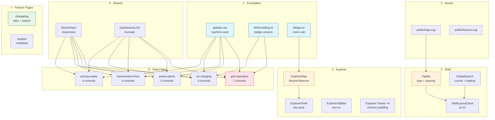
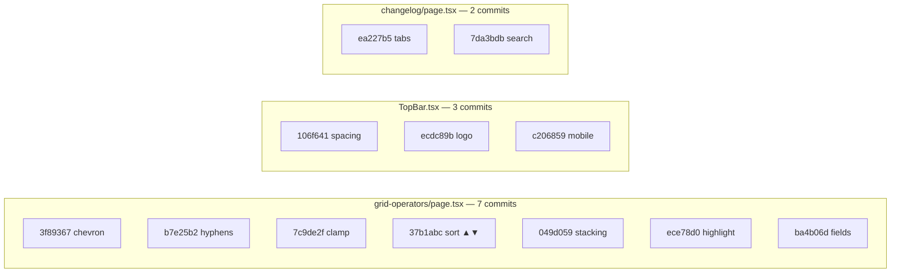
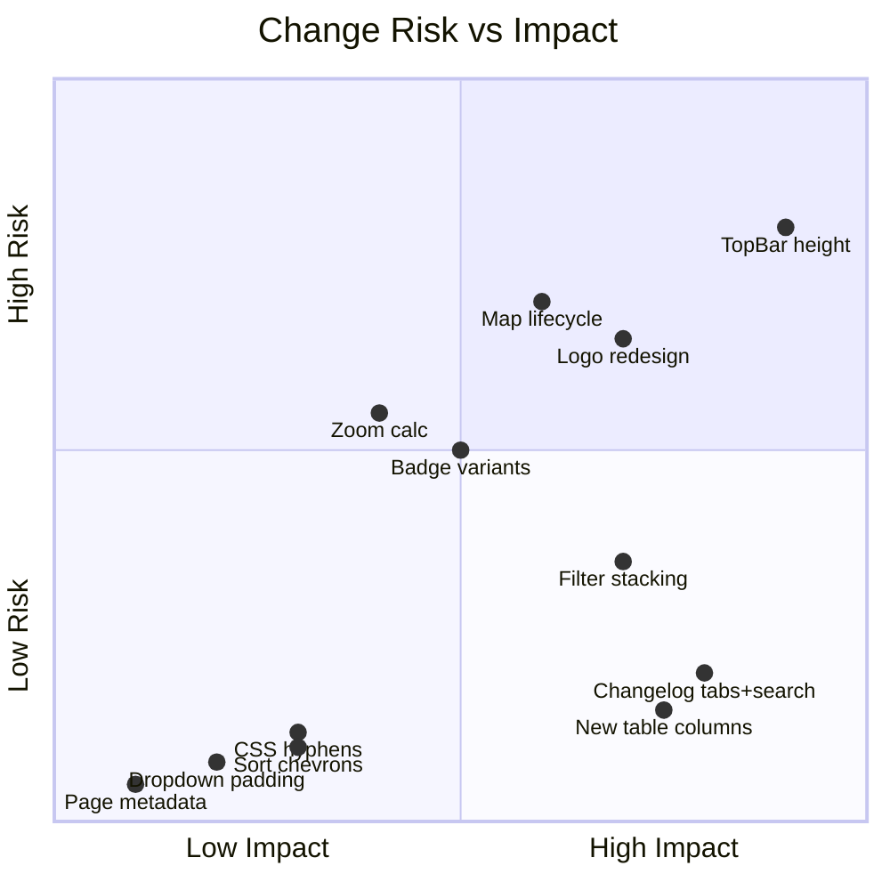

## Summary

Comprehensive UX, responsive design, and data-density overhaul across the CommonGrid registry. 23 commits addressing dropdown styling, table field coverage, sort UX, badge consistency, header spacing, Mapbox stability, changelog usability, narrow-viewport responsiveness, CMD+K search polish, and a new logo mark — the "G-in-C" with dendritic tree-graph connections.

## Motivation

CommonGrid's table pages, header, and explorer map had accumulated a set of fit-and-finish issues that individually were small but collectively degraded the experience — particularly on narrow viewports. This PR treats them as a cohesive surface area, applying consistent patterns (dropdown padding, filter stacking, sort indicators, hyphenation) across all 5 data pages, the explorer, and the changelog. The logo redesign gives CommonGrid a distinctive mark that communicates grid topology.

Addresses items from the [commongrid.info issue backlog](https://github.com/TextureHQ/commongrid/issues).

## Changeset Overview

| Metric | Value |
|--------|-------|
| Commits | **23** |
| Files changed | **25** |
| Insertions | **+425** |
| Deletions | **-179** |
| Net | **+246** |
| Commit types | 10 feat · 6 fix · 7 style |
| Risk profile | 18 low · 5 medium · 0 high |

## Commit Log

| Hash | Type | Scope | Description | Size | Risk |
|------|------|-------|-------------|------|------|
| `3f89367` | fix | dropdowns (9 files) | Inner right-side padding for chevrons | S | low |
| `b7e25b2` | fix | globals.css + 4 pages | CSS hyphenation for long entity names | S | low |
| `111ef3f` | fix | formatting.ts (×2) | Complete badge variant mapping for all utility segments | S | low |
| `106f641` | style | TopBar, ShellLayout, GlobalSearch | Header spacing overhaul (h-14→h-12, tighter nav) | M | med |
| `7c9de2f` | style | grid-operators | Conditional name clamping (line-clamp-2 / 1) | S | low |
| `37b1abc` | feat | 5 data pages | Sort-direction ▲/▼ chevrons in dropdown labels | S | low |
| `791740d` | feat | power-plants, transmission-lines | County, Year, Generators columns; From/To labels | M | low |
| `ece78d0` | feat | grid-operators | Jurisdiction state-based highlighting on filter | S | low |
| `ea227b5` | feat | changelog | Data Changes / Site Updates tab distinction | L | med |
| `c9e343a` | fix | ExplorerMap | ResizeObserver replaces setTimeout for map resize | M | med |
| `ecdc89b` | feat | TopBar, logo.svg | Logo redesign — G-in-C with dendritic graph | M | med |
| `049d059` | style | 5 data pages | Stack filter dropdowns vertically at narrow breakpoints | S | low |
| `ba4b06d` | feat | grid-operators | EIA ID, BA Code, NERC, website link columns | L | low |
| `00353ab` | feat | GlobalSearch | CMD+K result counts and loading state | S | low |
| `73c7db5` | fix | geo.ts | Finer-grained zoom for service territory bounds | S | med |
| `7da3bdb` | feat | changelog | Search input and entity-type filter chips | L | low |
| `8689455` | style | favicon.svg | Favicon updated to new logo mark | S | low |
| `ed04191` | fix | ExplorerShell | Layout key on ExplorerMap for clean remount | S | low |
| `f37bc36` | style | ExplorerTabBar | Mobile tab labels tightened to text-xs | S | low |
| `c206859` | style | TopBar | Mobile menu active state + hover backgrounds | M | low |
| `64d1943` | style | DataSourceLink | Truncate on narrow viewports | S | low |
| `cf533a9` | style | SearchInput | Responsive height (h-10/h-11) + hidden result count | S | low |
| `a3129d5` | feat | explore page | Page title and description metadata | S | low |

## File Impact Matrix

| File | Layer | +/- | Character |
|------|-------|-----|-----------|
| `app/(shell)/grid-operators/page.tsx` | page | +78 / -11 | Major: 4 new columns, highlighting, clamping, filters |
| `app/(shell)/changelog/page.tsx` | page | +116 / -6 | Major: tab UI, search, entity filters |
| `app/(shell)/power-plants/page.tsx` | page | +42 / -9 | New columns: county, year, generators |
| `app/(shell)/ev-charging/page.tsx` | page | +12 / -12 | Style: padding, stacking, hyphenation |
| `app/(shell)/pricing-nodes/page.tsx` | page | +9 / -9 | Style: padding, sort labels |
| `app/(shell)/transmission-lines/page.tsx` | page | +10 / -10 | Style + From/To substation labels |
| `app/(shell)/explore/page.tsx` | page | +6 / -0 | Metadata addition |
| `components/TopBar.tsx` | component | +45 / -39 | Logo SVG, spacing, mobile menu |
| `components/explorer/ExplorerMap.tsx` | component | +15 / -10 | ResizeObserver lifecycle fix |
| `components/explorer/ExplorerShell.tsx` | component | +3 / -3 | key={layout} prop |
| `components/GlobalSearch.tsx` | component | +6 / -2 | Result counts, loading text |
| `components/ShellLayoutClient.tsx` | component | +1 / -1 | pt-14 → pt-12 |
| `components/SearchInput.tsx` | component | +2 / -2 | Responsive height + hidden count |
| `components/DataSourceLink.tsx` | component | +1 / -1 | Truncation class |
| `components/explorer/ExplorerTabBar.tsx` | component | +1 / -1 | text-xs mobile labels |
| `components/explorer/panels/*` (4 files) | component | +4 / -4 | Dropdown chevron padding |
| `lib/formatting.ts` | lib | +9 / -9 | Badge variant remapping |
| `explorer/lib/formatting.ts` | lib | +9 / -9 | Badge variant remapping (mirror) |
| `lib/geo.ts` | lib | +8 / -5 | Zoom calculation refinement |
| `app/globals.css` | style | +8 / -0 | hyphens-auto utility class |
| `public/logo.svg` | asset | +20 / -18 | New G-in-C logo mark |
| `public/favicon.svg` | asset | +20 / -18 | Favicon matches new logo |

## Architecture & Dependency

### Review Order Dependency Graph



### Commit Clustering by File



## Impact Analysis

### Component Touch Map

```
App (layout.tsx)
 └── ShellLayoutClient ............... [pt-14→pt-12]
      ├── TopBar ..................... [h-12, gap-8, logo SVG, mobile menu]
      │    └── inline SVG ........... [12-circle grid → G-in-C dendritic]
      ├── GlobalSearchModal ......... [top-12, result counts, loading text]
      └── <page routes>
           ├── ChangelogPage ........ [tab bar, search, entity-type chips]
           ├── GridOperatorsPage .... [4 columns, highlighting, clamping]
           ├── PowerPlantsPage ...... [3 columns, hyphenation]
           ├── TransmissionLinesPage  [From/To labels, sort ▲▼]
           ├── EVChargingPage ....... [padding, stacking, hyphenation]
           ├── PricingNodesPage ..... [padding, sort ▲▼]
           └── ExplorePage .......... [metadata]
                └── ExplorerShell ... [key={layout}]
                     ├── ExplorerMap  [ResizeObserver, containerRef]
                     ├── ExplorerTabBar [text-xs mobile]
                     └── Panels ×4 .. [pl-2 pr-7]
```

### Responsive Breakpoint Audit

| Breakpoint | Changes |
|------------|---------|
| **< sm** (640px) | Filters stack vertically · Search result count hidden · Search input h-10 + text-sm · Name wraps to 2 lines · Tab labels text-xs · Loading indicator text hidden |
| **< md** (768px) | DataTable mobile mode (existing, unchanged) · Mobile menu gets active brand color + hover bg |
| **≥ lg** (1024px) | TopBar horizontal padding increases (px-4 → lg:px-6) |
| **All viewports** | Header h-14→h-12 · Nav padding tightened · Dropdown pr-7 for chevron · CSS hyphens-auto · Sort ▲/▼ labels · Badge variant colors |

### CSS / Tailwind Delta

<details>
<summary><strong>Classes Added</strong></summary>

| Class | Usage | Purpose |
|-------|-------|---------|
| `.hyphens-auto` (custom) | globals.css → 4 pages | Browser hyphenation for long names |
| `line-clamp-2 sm:line-clamp-1` | grid-operators name column | Responsive line wrapping |
| `flex-col sm:flex-row` | All filter containers | Vertical stacking on mobile |
| `pl-2 pr-7` | All `<select>` elements (9 files) | Asymmetric padding for native chevron |
| `animate-pulse` | Changelog sync indicator | Live data visual cue |
| `hidden sm:inline` | SearchInput count, GlobalSearch text | Hide on narrow |
| `hover:bg-background-surface` | Mobile menu items | Touch feedback |
| `tabular-nums` | New numeric columns | Monospace digit alignment |

</details>

<details>
<summary><strong>Classes Replaced</strong></summary>

| Before | After | Where |
|--------|-------|-------|
| `h-14` | `h-12` | TopBar container |
| `pt-14` | `pt-12` | ShellLayoutClient main offset |
| `top-14` | `top-12` | GlobalSearch backdrop |
| `px-5` | `px-4 lg:px-6` | TopBar horizontal padding |
| `gap-6` | `gap-8` | TopBar logo↔nav gap |
| `px-3 py-1.5` | `px-2.5 py-1` | TopBar nav links |
| `gap-1` | `gap-1.5` | TopBar icon groups |
| `text-[15px]` | `text-sm` | TopBar brand text |
| `px-2` | `pl-2 pr-7` | All filter `<select>` elements |
| `truncate` | `line-clamp-2 sm:line-clamp-1` | Grid-operators name cell |

</details>

## Risk Assessment

| Change | Risk | Blast Radius | Mitigation |
|--------|------|-------------|------------|
| TopBar h-14→h-12 + content offset | **Medium** | Every page (shell layout) | All 3 consumers updated: ShellLayoutClient, GlobalSearch backdrop, TopBar |
| Logo SVG replacement | **Medium** | Header + favicon | Same viewBox (32×32), same className, uses currentColor |
| ExplorerMap ResizeObserver | **Medium** | Map explorer page | ResizeObserver has universal browser support; RAF prevents layout thrash |
| Badge variant remapping | **Medium** | Grid-operators table + explorer panels | Both formatting.ts files updated in sync |
| Zoom calculation refinement | **Medium** | Service territory map views | Only affects zoom level selection, not data; more granular = better |
| Filter dropdown vertical stacking | **Low** | 5 data pages on mobile | Purely additive `flex-col` at default, `sm:flex-row` preserves desktop |
| New table columns | **Low** | grid-operators, power-plants | All `mobile: false` — desktop-only, zero mobile impact |
| Changelog tabs + search | **Low** | Changelog page only | Default tab shows existing view; search is additive |
| Sort ▲/▼ labels | **Low** | 5 data pages | Label text change only; no behavioral change |
| CSS hyphens-auto | **Low** | 4 data pages | CSS-only; respects browser's hyphenation engine |



## Deferred Work

Items explicitly out of scope for this PR, to be addressed in follow-up work:

- [ ] **Column hover panels with field enumeration** — requires `@floating-ui` popover work and computed stats (pie charts, mini maps). Tracked as Tier 3.
- [ ] **@tanstack/react-table migration** — new dependency; should be its own PR with migration of all 5 pages.
- [ ] **Explorer dual-panel layout** — requires extending `LayoutMode` type and ExplorerContext reducer.
- [ ] **Power plant custom fuel-type SVG icons** — art asset creation; needs design review.
- [ ] **Streaming changelog with auto-refresh** — needs `useSWR` or polling strategy decision.
- [ ] **Recent searches in CMD+K (localStorage)** — deferred to avoid scope creep; edit spec available.

## Test Plan

### Automated
- [ ] `next build` completes without errors
- [ ] Biome lint passes (`npx biome check`)

### Manual — Visual Regression
- [ ] **320px viewport**: Filters stack vertically, names wrap, no horizontal overflow
- [ ] **768px viewport**: DataTable switches to desktop mode, explorer hybrid layout works
- [ ] **1440px viewport**: All new columns visible, header spacing proportional
- [ ] **Dark mode**: Badge colors, logo, changelog tabs all render correctly
- [ ] **Light mode**: Same verification

### Manual — Functional
- [ ] CMD+K opens search → section headers show counts → loading text appears for Tier-2
- [ ] Grid-operators table: filter by jurisdiction → matching cells highlighted with brand color
- [ ] Changelog: switch between Data Changes / Site Updates tabs → entity-type chips filter correctly → search narrows results
- [ ] Explorer map: switch hybrid → list → map → hybrid → map doesn't blank
- [ ] Service territory detail pages: map zooms to territory bounds (not US-wide)
- [ ] All 5 data pages: sort dropdown shows ▲/▼ indicators

## Reviewer Checklist

- [ ] Changeset overview matches `git diff --stat main...welcome-pr`
- [ ] Risk assessment reviewed and agreed — no items should be elevated to "high"
- [ ] No secrets, credentials, or `.env` values committed
- [ ] Responsive behavior verified at 320px, 768px, 1440px
- [ ] Accessibility: focus order preserved, no contrast regressions
- [ ] Badge color changes reviewed against segment semantics (IOU=info, Coop=success, Municipal=warning, CCA=neutral)
- [ ] Logo mark reviewed for legibility at 24×24px

## Screenshots / Recordings

_Attach before/after screenshots at key breakpoints before merging._

| Viewport | Before | After |
|----------|--------|-------|
| Mobile (375px) | | |
| Tablet (768px) | | |
| Desktop (1440px) | | |
| Logo (24×24) |  |  |
