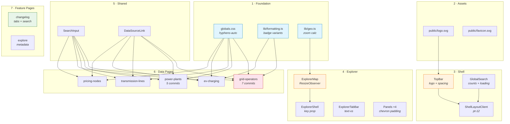
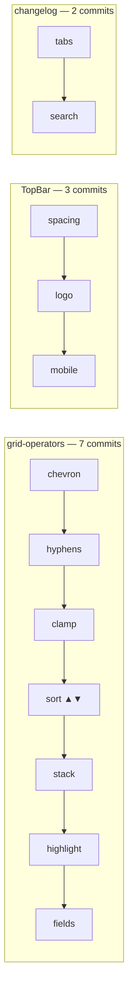

## Summary

Comprehensive UX, responsive design, and data-density overhaul across the CommonGrid registry. 23 commits addressing dropdown styling, table field coverage, sort UX, badge consistency, header spacing, Mapbox stability, changelog usability, narrow-viewport responsiveness, CMD+K search polish, and a new logo mark — the "G-in-C" with dendritic tree-graph connections.

## Change Type

- [x] `feat` — New feature or capability
- [x] `fix` — Bug fix
- [x] `style` — Visual/CSS changes (no logic change)
- [ ] `refactor`
- [ ] `docs`
- [ ] `test`
- [ ] `chore`
- [ ] `perf`

**User-facing change?** Yes — visual changes across all pages, new table columns, changelog tabs, logo redesign
**Breaking change?** No

## Changeset Overview

| Metric | Value |
|--------|-------|
| Commits | **23** |
| Files changed | **25** |
| Insertions (+) | **+425** |
| Deletions (−) | **−179** |
| Net | **+246** |
| PR size | **L** (425 insertions) |

| Breakdown | Count |
|-----------|-------|
| `feat` commits | 10 |
| `fix` commits | 6 |
| `style` commits | 7 |
| Low risk | 18 |
| Medium risk | 5 |
| High risk | 0 |

## Test Plan

### Automated
- [ ] `next build` completes without errors
- [ ] `npx biome check` passes

### Manual — Visual Regression
- [ ] **320px viewport**: Filters stack vertically, names wrap to 2 lines, no horizontal overflow
- [ ] **768px viewport**: DataTable switches to desktop mode, explorer hybrid layout works
- [ ] **1440px viewport**: All new columns visible (EIA ID, BA Code, NERC, Website, County, Year, Generators), header spacing proportional
- [ ] **Dark mode toggle**: Badge colors, logo mark, changelog tabs, filter chips all render correctly
- [ ] **Light mode toggle**: Same verification

### Manual — Functional
- [ ] CMD+K opens search → section headers show entity counts → "Loading more..." appears during Tier-2 fetch
- [ ] Grid-operators: filter by jurisdiction → matching cells highlighted with brand color + bold
- [ ] Grid-operators: new columns (EIA ID, BA Code, NERC, Website link) visible on desktop, hidden on mobile
- [ ] Changelog: switch Data Changes ↔ Site Updates tabs → entity-type filter chips narrow results → search bar filters by name/detail text
- [ ] Explorer map: switch hybrid → list → map → hybrid without blank/flash
- [ ] Service territory detail: map zooms to tight bounds, not US-wide
- [ ] All 5 data pages: sort dropdown labels show ▲/▼ direction indicators
- [ ] All data pages: native `<select>` chevrons have inner right padding (no text crowding)

---

## Motivation

CommonGrid's table pages, header, and explorer map had accumulated fit-and-finish issues that individually were small but collectively degraded the experience — particularly at narrow viewports and on the grid-operators registry page. This PR treats them as a cohesive surface area, applying consistent patterns across all 5 data pages, the explorer, and the changelog.

The logo redesign gives CommonGrid a distinctive mark — the letter G inscribed in C with dendritic tree-graph connections radiating outward — that communicates grid topology rather than a generic dot grid.

Addresses items from the [commongrid.info issue backlog](https://github.com/TextureHQ/commongrid/issues).

## Commit Log

| Hash | Type | Scope | Description | Size | Risk |
|------|------|-------|-------------|------|------|
| `3f89367` | fix | dropdowns (9 files) | Inner right-side padding for chevrons | S | low |
| `b7e25b2` | fix | globals.css + 4 pages | CSS hyphenation for long entity names | S | low |
| `111ef3f` | fix | formatting.ts (×2) | Complete badge variant mapping for all utility segments | S | low |
| `106f641` | style | TopBar, ShellLayout, GlobalSearch | Header spacing overhaul (h-14→h-12, tighter nav) | M | med |
| `7c9de2f` | style | grid-operators | Conditional name clamping (line-clamp-2/1) | S | low |
| `37b1abc` | feat | 5 data pages | Sort-direction ▲/▼ chevrons in dropdown labels | S | low |
| `791740d` | feat | power-plants, transmission-lines | County, Year, Generators columns; From/To labels | M | low |
| `ece78d0` | feat | grid-operators | Jurisdiction state-based highlighting on filter | S | low |
| `ea227b5` | feat | changelog | Data Changes / Site Updates tab distinction | L | med |
| `c9e343a` | fix | ExplorerMap | ResizeObserver replaces setTimeout for map resize | M | med |
| `ecdc89b` | feat | TopBar, logo.svg | Logo redesign — G-in-C with dendritic graph | M | med |
| `049d059` | style | 5 data pages | Stack filter dropdowns vertically at narrow breakpoints | S | low |
| `ba4b06d` | feat | grid-operators | EIA ID, BA Code, NERC, website link columns | L | low |
| `00353ab` | feat | GlobalSearch | CMD+K result counts and loading state | S | low |
| `73c7db5` | fix | geo.ts | Finer-grained zoom for service territory bounds | S | med |
| `7da3bdb` | feat | changelog | Search input and entity-type filter chips | L | low |
| `8689455` | style | favicon.svg | Favicon updated to new logo mark | S | low |
| `ed04191` | fix | ExplorerShell | Layout key on ExplorerMap for clean remount | S | low |
| `f37bc36` | style | ExplorerTabBar | Mobile tab labels tightened to text-xs | S | low |
| `c206859` | style | TopBar | Mobile menu active state + hover backgrounds | M | low |
| `64d1943` | style | DataSourceLink | Truncate on narrow viewports | S | low |
| `cf533a9` | style | SearchInput | Responsive height (h-10/h-11) + hidden result count | S | low |
| `a3129d5` | feat | explore page | Page title and description metadata | S | low |

## File Impact Matrix

| File | Layer | +/− | Character |
|------|-------|-----|-----------|
| `app/(shell)/grid-operators/page.tsx` | page | +78/−11 | Major: 4 columns, highlighting, clamping |
| `app/(shell)/changelog/page.tsx` | page | +116/−6 | Major: tab UI, search, entity filters |
| `app/(shell)/power-plants/page.tsx` | page | +42/−9 | New columns: county, year, generators |
| `app/(shell)/ev-charging/page.tsx` | page | +12/−12 | Style: padding, stacking, hyphenation |
| `app/(shell)/pricing-nodes/page.tsx` | page | +9/−9 | Style: padding, sort labels |
| `app/(shell)/transmission-lines/page.tsx` | page | +10/−10 | Style + From/To label rename |
| `app/(shell)/explore/page.tsx` | page | +6/−0 | Metadata |
| `components/TopBar.tsx` | component | +45/−39 | Logo SVG, spacing, mobile menu |
| `components/explorer/ExplorerMap.tsx` | component | +15/−10 | ResizeObserver lifecycle fix |
| `components/explorer/ExplorerShell.tsx` | component | +3/−3 | key={layout} prop |
| `components/GlobalSearch.tsx` | component | +6/−2 | Result counts, loading text |
| `components/ShellLayoutClient.tsx` | component | +1/−1 | pt-14→pt-12 |
| `components/SearchInput.tsx` | component | +2/−2 | Responsive height + hidden count |
| `components/DataSourceLink.tsx` | component | +1/−1 | Truncation |
| `components/explorer/ExplorerTabBar.tsx` | component | +1/−1 | text-xs mobile |
| `components/explorer/panels/*` (×4) | component | +4/−4 | Dropdown chevron padding |
| `lib/formatting.ts` | lib | +9/−9 | Badge variant remapping |
| `explorer/lib/formatting.ts` | lib | +9/−9 | Badge variant remapping (mirror) |
| `lib/geo.ts` | lib | +8/−5 | Zoom calculation refinement |
| `app/globals.css` | style | +8/−0 | `hyphens-auto` utility class |
| `public/logo.svg` | asset | +20/−18 | G-in-C logo mark |
| `public/favicon.svg` | asset | +20/−18 | Favicon matches new logo |

## Architecture & Dependency

### Review Order Dependency Graph



### Commit Clustering by Shared File



## Changelog

### Added
- Sort-direction ▲/▼ indicators in all table sort dropdowns
- Grid-operators table: EIA ID, BA Code, NERC Region, Website columns
- Power-plants table: County, Operating Year, Generator Count columns
- Transmission-lines table: From/To substation labels (renamed from Sub 1/Sub 2)
- Changelog page: Data Changes / Site Updates tab bar
- Changelog page: entity-type filter chips + text search
- Changelog page: pulsing sync indicator
- Jurisdiction highlighting when filter is active (brand color + bold)
- CSS `hyphens-auto` utility class for browser word-breaking
- Explore page: title and description metadata
- CMD+K search: entity count badges on section headers
- CMD+K search: "Loading more..." text for Tier-2 data

### Changed
- Logo: 12-circle grid → G-in-C with dendritic tree-graph connections
- Favicon: updated to match new logo mark
- Header: h-14 → h-12, tighter nav padding, larger logo-to-nav gap
- Badge variants: Distribution Coop (warning→success), Municipal (success→warning), CCA (success→neutral), G&T (default→success), Transmission Operator (default→info), Joint Action (default→success)
- Grid-operators name column: truncate → line-clamp-2 on mobile, line-clamp-1 on desktop
- Mobile menu: added active brand color, hover backgrounds, border separator for GitHub link
- Explorer tab labels: reduced to text-xs on mobile
- Search input: h-11 → h-10 on mobile, result count hidden on narrow viewports
- DataSourceLink: added truncation for narrow viewports

### Fixed
- Native `<select>` chevron crowding text — asymmetric padding (pl-2 pr-7) across 9 files
- Mapbox component loads-then-blanks — ResizeObserver replaces fragile setTimeout
- Map layout mode switch causing stale renders — key={layout} forces clean remount
- Service territory zoom too wide — finer-grained zoom thresholds with intermediate steps
- Filter dropdowns overflowing on narrow viewports — flex-col stacking below sm breakpoint

## Responsive Breakpoint Audit

| Breakpoint | Changes |
|------------|---------|
| **< sm** (640px) | Filters stack vertically · Search result count hidden · Input h-10 + text-sm · Names wrap 2 lines · Tab labels text-xs · Loading text hidden |
| **< md** (768px) | Mobile menu: brand color active state + hover bg (new) · DataTable mobile mode (existing) |
| **≥ lg** (1024px) | TopBar px-4 → lg:px-6 |
| **All viewports** | Header h-14→h-12 · Nav tightened · Select pr-7 · CSS hyphens · Sort ▲/▼ · Badge colors |

<details>
<summary><strong>CSS / Tailwind Delta — Classes Added</strong></summary>

| Class | Usage | Purpose |
|-------|-------|---------|
| `.hyphens-auto` (custom) | globals.css → 4 pages | Browser hyphenation for long names |
| `line-clamp-2 sm:line-clamp-1` | grid-operators name | Responsive line wrapping |
| `flex-col sm:flex-row` | All filter containers | Vertical stacking on mobile |
| `pl-2 pr-7` | All `<select>` (9 files) | Asymmetric padding for native chevron |
| `animate-pulse` | Changelog sync dot | Live data visual cue |
| `hidden sm:inline` | SearchInput count, GlobalSearch text | Narrow-viewport hide |
| `hover:bg-background-surface` | Mobile menu items | Touch feedback |
| `tabular-nums` | New numeric columns | Monospace digit alignment |

</details>

<details>
<summary><strong>CSS / Tailwind Delta — Classes Replaced</strong></summary>

| Before | After | Where |
|--------|-------|-------|
| `h-14` | `h-12` | TopBar, ShellLayoutClient, GlobalSearch |
| `pt-14` | `pt-12` | ShellLayoutClient main offset |
| `top-14` | `top-12` | GlobalSearch backdrop |
| `px-5` | `px-4 lg:px-6` | TopBar horizontal padding |
| `gap-6` | `gap-8` | TopBar logo↔nav gap |
| `px-3 py-1.5` | `px-2.5 py-1` | TopBar nav links |
| `gap-1` | `gap-1.5` | TopBar icon groups |
| `text-[15px]` | `text-sm` | TopBar brand text |
| `px-2` | `pl-2 pr-7` | All filter `<select>` elements |
| `truncate` | `line-clamp-2 sm:line-clamp-1 hyphens-auto` | Grid-operators name cell |

</details>

## Risk Assessment

| Change | Risk | Blast Radius | Mitigation |
|--------|------|-------------|------------|
| TopBar h-14→h-12 + content offset | **Medium** | Every page (shell layout) | All 3 consumers updated: ShellLayoutClient, GlobalSearch, TopBar |
| Logo SVG replacement | **Medium** | Header + favicon | Same viewBox (32×32), same className, uses currentColor |
| ExplorerMap ResizeObserver | **Medium** | Map explorer page | Universal browser support; RAF prevents layout thrash |
| Badge variant remapping | **Medium** | Grid-operators + explorer panels | Both formatting.ts files updated in sync |
| Zoom calculation changes | **Medium** | Service territory map views | More granular = better; additive thresholds only |
| Filter vertical stacking | **Low** | 5 data pages on mobile | Purely additive `flex-col` default; `sm:flex-row` preserves desktop |
| New table columns | **Low** | grid-operators, power-plants | All `mobile: false` — zero mobile impact |
| Changelog tabs + search | **Low** | Changelog page only | Default tab shows existing view; search is additive |
| Sort ▲/▼ labels | **Low** | 5 data pages | Label text only; no behavioral change |
| CSS hyphens-auto | **Low** | 4 data pages | CSS-only; browser hyphenation engine |


## Deferred Work

- [ ] **Column hover panels with field enumeration / pie charts** — requires `@floating-ui` popover work. Tier 3.
- [ ] **@tanstack/react-table migration** — new dependency; deserves its own PR.
- [ ] **Explorer dual-panel layout** — requires `LayoutMode` type extension + reducer changes.
- [ ] **Power plant custom fuel-type SVG icons** — art asset creation; needs design review.
- [ ] **Streaming changelog with auto-refresh** — needs `useSWR` or polling strategy decision.
- [ ] **Recent searches in CMD+K (localStorage)** — edit spec available; deferred to limit scope.

## Reviewer Checklist

- [ ] Changeset overview matches `git diff --stat main...welcome-pr`
- [ ] Risk assessment reviewed — no items should be elevated to "high"
- [ ] No secrets, credentials, or `.env` values committed
- [ ] Responsive behavior verified at 320px, 768px, 1440px
- [ ] Accessibility: focus order preserved, no contrast regressions
- [ ] Badge color changes reviewed against segment semantics (IOU=info, Coop=success, Municipal=warning, CCA=neutral)
- [ ] Logo mark legible at 24×24px in both light and dark mode

## Screenshots / Recordings

_Attach before/after screenshots at key breakpoints before merging._

| Viewport | Before | After |
|----------|--------|-------|
| Mobile (375px) | | |
| Tablet (768px) | | |
| Desktop (1440px) | | |
| Logo (24×24) | | |

```release-note
Redesigned CommonGrid logo to G-in-C dendritic mark. Added EIA ID, BA Code,
NERC, and Website columns to grid-operators table. Added County, Year, and
Generator Count to power-plants. Introduced Data Changes / Site Updates tabs
and search on changelog. Sort dropdowns now show ▲/▼ direction. Fixed Mapbox
blank-on-layout-switch, dropdown chevron padding, and badge color mapping.
Improved responsive design at narrow viewports across all data pages.
```
