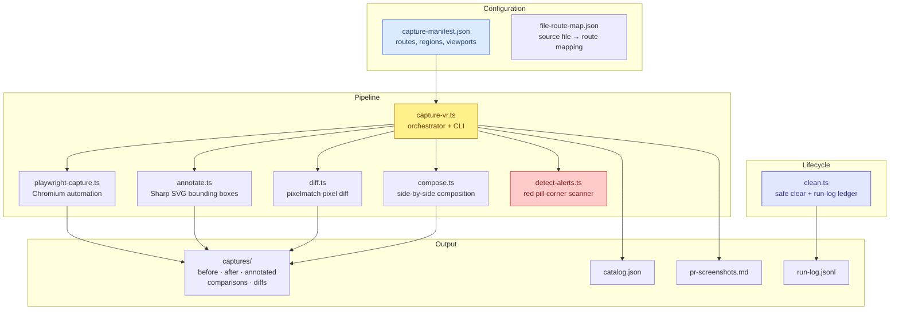

<!--
  PR Description: diffwatch
  Convention: CommonGrid PR Description Standard v1.0

  This PR is one of a two-PR set:
    1. hello-pr        — UX, responsive design, and data-density overhaul
    2. diffwatch       — Visual regression capture system (this PR)

  Diffwatch was built during hello-pr development to verify visual changes.
  The commit history interleaves chronologically, but this PR is self-contained.
-->

## Summary

Diffwatch is a visual regression capture system for CommonGrid. It automates before/after screenshot generation, region annotation, pixel diffing, side-by-side comparison composition, and alert detection — producing a markdown report and catalog for PR review. Built as dev tooling during the hello-pr UX overhaul to systematically verify 25+ visual changes across 9 pages and 3 viewport tiers.

## Change Type

- [x] `feat` — New feature or capability
- [x] `fix` — Bug fix
- [x] `docs` — Documentation only
- [x] `chore` — Build, CI, dependency, or tooling changes
- [ ] `style`
- [ ] `refactor`
- [ ] `test`
- [ ] `perf`

**User-facing change?** No — dev tooling only
**Breaking change?** No

## Changeset Overview

| Metric | Value |
|--------|-------|
| Commits | **7** |
| New files | **10** |
| PR size | **L** |

| Breakdown | Count |
|-----------|-------|
| `feat` commits | 1 (core implementation) |
| `fix` commits | 2 (worktree prebuild, port conflicts) |
| `docs` commits | 3 (spec, reference, as-built rewrite) |
| `chore` commits | 1 (detect-alerts + clean script) |

---

## Motivation

The hello-pr branch accumulated 25+ commits touching 9 pages across 3 viewport tiers. We wanted first-class observability of visual changes directly within the PR description — not as a manual appendix, but as an automated, reproducible artifact that an agent or developer can generate on demand.

Diffwatch applies established visual regression analysis methods — before/after capture, pixel diffing, annotated comparison composition — in an agent-first paradigm where the default workflow is automated capture rather than manual screenshotting. The pipeline is manifest-driven: define targets (routes, regions, viewports), and Diffwatch handles the full cycle — parallel dev servers via git worktree isolation, headless Chromium capture, region annotation, pixel diff quantification, side-by-side composition, error indicator detection, and markdown report generation.

### Design Decisions
- **Git worktree** (not stash/checkout) — enables parallel base + PR servers simultaneously
- **Sharp SVG composite** (not Canvas) — no native dependency; works on any OS without `node-canvas` build
- **pixelmatch** — same diff engine Playwright uses internally; consistent threshold semantics
- **Edge-margin alert detection** — scans only screenshot corners for red pill indicators, ignoring legitimate red UI elements in page content

## Architecture & Dependency



### Execution Flow

```mermaid
flowchart LR
    CLI[CLI args] --> PRE[Prebuild<br>+ port check]
    PRE --> SRV[Start servers<br>PR:4101 Base:4100]
    SRV --> CAP[Playwright<br>capture loop]
    CAP --> KILL[Kill servers<br>remove worktree]
    KILL --> ANN[Annotate<br>+ diff]
    ANN --> SCAN[Alert<br>scan]
    SCAN --> OUT[Compose<br>+ report]

    style CLI fill:#f8fafc,stroke:#64748b,color:#1e293b
    style SRV fill:#dbeafe,stroke:#1d4ed8,color:#1e3a5f
    style CAP fill:#dbeafe,stroke:#1d4ed8,color:#1e3a5f
    style KILL fill:#fecaca,stroke:#b91c1c,color:#7f1d1d
    style SCAN fill:#fef08a,stroke:#a16207,color:#713f12
    style OUT fill:#bbf7d0,stroke:#15803d,color:#14532d
```



---

## Risk Assessment

| Change | Risk | Blast Radius | Mitigation |
|--------|------|-------------|------------|
| New dev dependencies (playwright, sharp, pixelmatch, pngjs) | **Low** | Dev only | Not bundled; gitignored output |
| Git worktree operations in /tmp | **Low** | Local filesystem | Force-cleanup in finally blocks |
| Port 4100/4101 usage | **Low** | Local dev only | Pre-flight port check aborts if occupied |
| npm script additions | **Low** | package.json | Additive; no existing scripts modified |

---

## Commit Log

| Hash | Type | Description | Size | Risk |
|------|------|-------------|------|------|
| `2622431` | docs | Visual regression capture system specification | L | low |
| `ca3ae6b` | docs | Concrete implementation reference and tool landscape | M | low |
| `f117566` | feat | Implement Diffwatch — 5 core modules (capture, annotate, diff, compose, playwright) | XL | low |
| `3494749` | fix | Resolve 404 in BEFORE captures by running prebuild in worktree | S | low |
| `ffecf2f` | fix | Change ports to 4100/4101 + port-availability check | S | low |
| `534f46d` | docs | Rewrite as as-built reference with mermaid diagrams | L | low |
| _staged_ | feat | Alert indicator detection (detect-alerts.ts) + clean script (clean.ts) | M | low |

### Commit Clustering by Shared File

| File | Commits | Progression |
|------|---------|-------------|
| `capture-vr.ts` | 3 | implement → prebuild fix → port fix |
| `visual-regression-system.md` | 3 | spec → reference → as-built rewrite |
| `capture-manifest.json` | 1 | initial capture definitions |

## File Impact Matrix

| File | Layer | Character |
|------|-------|-----------|
| `scripts/visual-regression/capture-vr.ts` | tooling | Orchestrator: CLI, servers, worktree, phases |
| `scripts/visual-regression/playwright-capture.ts` | tooling | Headless Chromium: navigate, wait, screenshot, bbox |
| `scripts/visual-regression/annotate.ts` | tooling | Sharp SVG composite: bounding boxes + labels |
| `scripts/visual-regression/compose.ts` | tooling | Side-by-side comparison image composition |
| `scripts/visual-regression/diff.ts` | tooling | pixelmatch: pixel-level diff + overlay |
| `scripts/visual-regression/detect-alerts.ts` | tooling | Edge-margin red pill scanner |
| `scripts/visual-regression/clean.ts` | tooling | Safe clear + run-log.jsonl archival |
| `scripts/visual-regression/capture-manifest.json` | config | Route, region, viewport definitions |
| `scripts/visual-regression/file-route-map.json` | config | Source file → affected route mapping |
| `docs/visual-regression-system.md` | docs | As-built reference with mermaid diagrams |
| `package.json` | config | npm scripts: vr:capture, vr:capture:pr-only, vr:clean, vr:clean:all |
| `.gitignore` | config | .visual-regression/ exclusion |

---

## Changelog

### Added
- `npm run vr:capture` — full before/after screenshot pipeline via git worktree + parallel dev servers
- `npm run vr:capture:pr-only` — PR-only mode (skip base worktree)
- `npm run vr:clean` — safe output clear with run-log archival
- `npm run vr:clean:all` — full clear including run-log
- CLI flags: `--base-ref`, `--captures`, `--viewports`, `--skip-capture`, `--skip-base`, `--skip-compose`, `--output`
- Capture manifest schema with routes, regions, viewports, actions, color semantics
- Region annotation with 5 semantic colors (red/green/blue/orange/yellow)
- Pixel diff quantification via pixelmatch (threshold 0.1)
- Side-by-side comparison composition with title bar and footer
- Edge-margin red pill alert detection (Next.js error indicator scanner)
- Run-log.jsonl reconstruction ledger surviving cleans
- As-built documentation with mermaid diagrams

---

## Screenshots / Recordings

_Diffwatch is dev tooling — no user-facing screenshots. Example outputs from the hello-pr run:_

### Example Comparison Output
<!--  -->
_Side-by-side composition: title bar with description and viewport, BEFORE | AFTER panels, footer with branch labels._

### Example Alert Detection
<!--  -->
_Red pill indicator (Next.js "1 Issue") detected in bottom-left corner of sort-chevrons capture._

---

## Reviewer Checklist

- [ ] No secrets, credentials, or `.env` values committed
- [ ] All new files are under `scripts/visual-regression/` or `docs/`
- [ ] `.visual-regression/` is in `.gitignore`
- [ ] `npm run vr:capture` runs to completion
- [ ] `npm run vr:clean` archives metadata and clears output
- [ ] Documentation in `docs/visual-regression-system.md` matches implementation

## Test Plan

### Automated
- [ ] `npm run vr:capture` completes without errors (full pipeline)
- [ ] `npm run vr:capture -- --captures badge-variants --viewports desktop` (filtered run)
- [ ] `npm run vr:capture -- --skip-capture` (reprocess existing screenshots)
- [ ] `npm run vr:clean` (archive + clear)
- [ ] `npm run vr:clean -- --dry-run` (preview without deleting)

### Manual
- [ ] Alert detection flags the Next.js "1 Issue" pill on sort-chevrons but not legitimate red badges
- [ ] Run-log.jsonl contains reconstruction metadata after clean
- [ ] Comparison images render correctly with title bar, divider, and footer

## Deferred Work

- [ ] **Gridwatch CI integration** — run captures in GitHub Actions on PR open
- [ ] **Threshold-based pass/fail** — auto-fail if diff exceeds configurable percentage
- [ ] **Full-page capture mode** — option for scrollable page screenshots
- [ ] **Dark mode captures** — capture both color schemes per viewport
- [ ] **Image upload automation** — push comparison images to GitHub issue for embedding

---

```release-note
Added Diffwatch — a visual regression capture system for automated before/after
screenshot comparison. Captures screenshots via parallel dev servers with git
worktree isolation, annotates regions of interest, computes pixel diffs, composes
side-by-side comparison images, and detects error indicators automatically.
```
