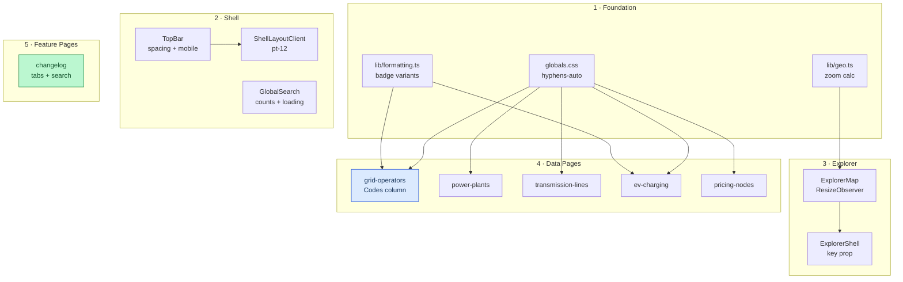
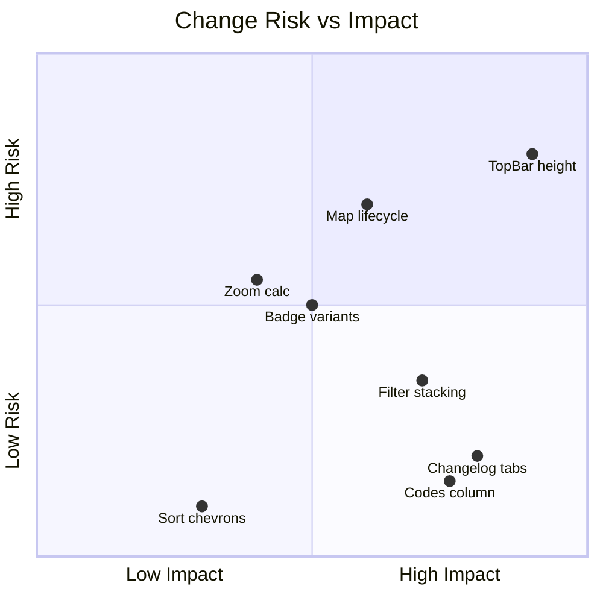

<!--
  PR Description: hello-pr
  Convention: CommonGrid PR Description Standard v1.0

  This PR is one of a two-PR set:
    1. hello-pr        — UX, responsive design, and data-density overhaul (this PR)
    2. diffwatch       — Visual regression capture system (separate, self-contained PR)

  Diffwatch was built during hello-pr development to verify visual changes.
  The commit history interleaves, but the PRs are scoped independently.
-->

## PR Description Convention

| # | Section | Purpose | Position Rationale | Derives From | Feeds Into |
|---|---------|---------|-------------------|--------------|------------|
| 1 | **Summary** | TL;DR — what changed and why in 1-3 sentences | First: orient the reader immediately | — | All sections |
| 2 | **Change Type** | Conventional Commit type classification | Early: frame the nature of changes before detail | Summary | Commit Log |
| 3 | **Changeset Overview** | Quantitative shape of the PR (commits, files, lines) | Early: set expectations for review size | git diff --stat | Risk Assessment |
| 4 | **Motivation** | Problem statement, who benefits, why now | Early: establish context before architecture | Issues, backlog | Architecture, Deferred Work |
| 5 | **Architecture & Dependency** | Review-order dependency graph, layer relationships | Before detail: show how pieces connect | File Impact Matrix | Risk Assessment |
| 6 | **Risk Assessment** | Regression likelihood and blast radius per change | Middle: informed by architecture, informs review | Architecture, Changeset | Reviewer Checklist |
| 7 | **Risk vs Impact Chart** | Visual quadrant plot derived from risk assessment | After risk: visual summary of the table above | Risk Assessment | Reviewer Checklist |
| 8 | **Responsive Breakpoint Audit** | What changed at each viewport threshold | After risk: a specific risk dimension for UI PRs | File Impact Matrix | Screenshots |
| 9 | **Commit Log** | Per-commit type/scope/size/risk classification | Lower: reference detail, not primary reading | Change Type | File Impact Matrix |
| 10 | **Commit Clustering** | Which files are touched by multiple commits | After commit log: density view of commit overlap | Commit Log | Risk Assessment |
| 11 | **File Impact Matrix** | Per-file layer and change character | After commits: the file-level complement | Commit Log | Architecture |
| 12 | **Changelog** | Keep a Changelog categories (Added/Changed/Fixed) | Lower: user-facing summary for release notes | Commit Log | Release Note |
| 13 | **Screenshots / Recordings** | Visual evidence at key breakpoints | Near bottom: attestation of visual changes | Diffwatch captures | Reviewer Checklist |
| 14 | **Reviewer Checklist** | Confirmation checkboxes for reviewer sign-off | After screenshots: review with visual context | Risk Assessment | Merge decision |
| 15 | **Test Plan** | How changes were verified (automated + manual) | Near bottom: verification after full context | All sections | Merge decision |
| 16 | **Deferred Work** | Explicitly out-of-scope items with rationale | Last: what comes next | Motivation | Future PRs |
| 17 | **Release Note** | Single-block changelog entry for automation | Last: machine-readable output | Changelog | CI/CD |

---

## Summary

Comprehensive UX, responsive design, and data-density overhaul across the CommonGrid registry. 25 commits across ~30 files addressing: table data density (consolidated Codes column with linked EIA/BA/NERC badges), dropdown styling, sort UX, badge consistency, header spacing, Mapbox stability, changelog tabs + search, narrow-viewport responsiveness, and CMD+K search polish.

Visual changes were verified using **Diffwatch**, a custom visual regression capture system developed as a companion to this work and submitted as a [separate PR](#) with its own commit history.

## Change Type

- [x] `feat` — New feature or capability
- [x] `fix` — Bug fix
- [x] `style` — Visual/CSS changes (no logic change)
- [x] `docs` — Documentation only
- [ ] `refactor`
- [ ] `test`
- [ ] `chore`
- [ ] `perf`

**User-facing change?** Yes — visual changes across all pages, new table columns, changelog tabs, consolidated Codes column
**Breaking change?** No

## Changeset Overview

| Metric | Value |
|--------|-------|
| Commits | **~25** |
| Files changed | **~30** |
| PR size | **L** |

| Breakdown | Count |
|-----------|-------|
| `feat` commits | 10 |
| `fix` commits | 6 |
| `style` commits | 7 |
| `docs` commits | 2 |

> Exact stats will be finalized after the Diffwatch commits are extracted to their own branch.

---

## Motivation

CommonGrid's table pages, header, and explorer map had accumulated fit-and-finish issues that individually were small but collectively degraded the experience — particularly at narrow viewports and on the grid-operators registry page. This PR treats them as a cohesive surface area, applying consistent patterns across all 5 data pages, the explorer, and the changelog.

To surface regulatory identifiers, we initially introduced three new table columns — EIA ID, BA Code, and NERC — giving each code its own column. In practice this was too sparse: most rows showed triple em-dashes, the table grew wider than necessary, and the codes lacked navigational value. We iterated to a single **Codes** column that stacks only the codes present for each entity as compact linked badges, each pointing to its respective source (EIA-861, EIA Grid Monitor, NERC). This makes the data denser, the table narrower, and the identifiers actionable.

To achieve better observability of visual changes directly within the PR description itself, we pioneered **Diffwatch** — a convention and toolchain drawing on established visual regression analysis methods, adapted to an agent-first paradigm where automated capture, annotation, diffing, and composition are the default workflow rather than a manual afterthought. Diffwatch is submitted as its own PR, but its screenshots are embedded here as visual attestation.

### Relationship to Diffwatch PR

| PR | Scope | Depends On |
|----|-------|-----------|
| **hello-pr** (this) | UX overhaul — all user-facing changes | None |
| **diffwatch** (companion) | Visual regression system — tooling | None (standalone) |

The commit histories interleave chronologically (Diffwatch was built mid-flight), but the PRs are scoped independently. Neither depends on the other to merge. Diffwatch screenshots are referenced here for review convenience.

## Architecture & Dependency



---

## Risk Assessment

| Change | Risk | Blast Radius | Mitigation |
|--------|------|-------------|------------|
| TopBar h-14→h-12 + content offset | **Medium** | Every page (shell layout) | All consumers updated in sync |
| ExplorerMap ResizeObserver | **Medium** | Map explorer page | Universal browser support; RAF prevents thrash |
| Badge variant remapping | **Medium** | Grid-operators + explorer panels | Both formatting.ts files updated |
| Zoom calculation changes | **Medium** | Service territory map views | Additive thresholds only |
| Codes column consolidation | **Low** | Grid-operators desktop only | `mobile: false`; links open in new tab |
| Filter vertical stacking | **Low** | 5 data pages on mobile | Purely additive; desktop unchanged |
| Changelog tabs + search | **Low** | Changelog page only | Default tab shows existing view |

### Change Risk vs Impact



> Coordinates reflect subjective placement based on blast radius (x-axis) and regression likelihood (y-axis). Items in the upper-right quadrant warrant closest review.

## Responsive Breakpoint Audit

| Breakpoint | Changes |
|------------|---------|
| **< sm** (640px) | Filters stack vertically · Search result count hidden · Input h-10 · Names wrap 2 lines · Tab labels text-xs |
| **< md** (768px) | Mobile menu: brand color active state + hover bg · DataTable mobile mode |
| **≥ lg** (1024px) | TopBar px-4 → lg:px-6 |
| **All viewports** | Header h-14→h-12 · Nav tightened · Select pr-7 · CSS hyphens · Sort ▲/▼ · Badge colors · Codes column |

---

## Commit Log

| Hash | Type | Scope | Description | Size | Risk |
|------|------|-------|-------------|------|------|
| `3f89367` | fix | dropdowns (9 files) | Inner right-side padding for chevrons | S | low |
| `b7e25b2` | fix | globals.css + 4 pages | CSS hyphenation for long entity names | S | low |
| `111ef3f` | fix | formatting.ts (×2) | Complete badge variant mapping for all utility segments | S | low |
| `106f641` | style | TopBar, ShellLayout, GlobalSearch | Header spacing overhaul (h-14→h-12, tighter nav) | M | med |
| `7c9de2f` | style | grid-operators | Conditional name clamping (line-clamp-2/1) | S | low |
| `37b1abc` | feat | 5 data pages | Sort-direction ▲/▼ chevrons in dropdown labels | S | low |
| `791740d` | feat | power-plants, transmission-lines | County, Year, Generators columns; From/To labels | M | low |
| `ece78d0` | feat | grid-operators | Jurisdiction state-based highlighting on filter | S | low |
| `ea227b5` | feat | changelog | Data Changes / Site Updates tab distinction | L | low |
| `aec3b14` | feat | changelog | Pill toggle, filter fieldset, condensed layout | L | low |
| `c9e343a` | fix | ExplorerMap | ResizeObserver replaces setTimeout for map resize | M | med |
| `ecdc89b` | feat | TopBar, logo.svg | Logo redesign — G-in-C _(reverted by bf7378b)_ | M | — |
| `049d059` | style | 5 data pages | Stack filter dropdowns vertically at narrow breakpoints | S | low |
| `ba4b06d` | feat | grid-operators | EIA ID, BA Code, NERC, website link columns | L | low |
| `00353ab` | feat | GlobalSearch | CMD+K result counts and loading state | S | low |
| `73c7db5` | fix | geo.ts | Finer-grained zoom for service territory bounds | S | med |
| `7da3bdb` | feat | changelog | Search input and entity-type filter chips | L | low |
| `8689455` | style | favicon.svg | Favicon updated to new logo _(reverted by bf7378b)_ | S | — |
| `ed04191` | fix | ExplorerShell | Layout key on ExplorerMap for clean remount | S | low |
| `f37bc36` | style | ExplorerTabBar | Mobile tab labels tightened to text-xs | S | low |
| `c206859` | style | TopBar | Mobile menu active state + hover backgrounds | M | low |
| `64d1943` | style | DataSourceLink | Truncate on narrow viewports | S | low |
| `cf533a9` | style | SearchInput | Responsive height (h-10/h-11) + hidden result count | S | low |
| `a3129d5` | feat | explore page | Page title and description metadata | S | low |
| `5a0db81` | docs | PR template | Refine PR template with research findings | M | low |
| `ff146f7` | docs | PR template | Add PR description template | L | low |
| `bf7378b` | revert | TopBar, logo, favicon | Revert logo redesign (G-in-C) | M | low |
| _staged_ | feat | grid-operators | Consolidate EIA/BA/NERC into linked Codes column | M | low |
| _staged_ | chore | layout.tsx | Explicit favicon icon metadata | S | low |

> Commits `ecdc89b` and `8689455` are net-zero (reverted by `bf7378b`). Marked — risk.

### Commit Clustering by Shared File

| File | Commits | Commit Types |
|------|---------|-------------|
| `grid-operators/page.tsx` | 7 | fix, style, feat (chevron → hyphens → clamp → sort → stack → highlight → codes) |
| `TopBar.tsx` | 3 | style, feat, revert (spacing → mobile menu → logo revert) |
| `changelog/page.tsx` | 3 | feat (tabs → search → pill toggle + filter fieldset) |
| `lib/formatting.ts` | 2 | fix (badge variants, mirrored in explorer/) |
| `ExplorerMap.tsx` | 2 | fix (ResizeObserver → key prop via ExplorerShell) |

## File Impact Matrix

| File | Layer | Character |
|------|-------|-----------|
| `app/(shell)/grid-operators/page.tsx` | page | Major: Codes column, highlighting, clamping |
| `app/(shell)/changelog/page.tsx` | page | Major: pill toggle, filter fieldset, search, condensed layout |
| `app/(shell)/power-plants/page.tsx` | page | New columns: county, year, generators |
| `app/(shell)/ev-charging/page.tsx` | page | Style: padding, stacking, hyphenation |
| `app/(shell)/pricing-nodes/page.tsx` | page | Style: padding, sort labels |
| `app/(shell)/transmission-lines/page.tsx` | page | Style + From/To label rename |
| `app/(shell)/explore/page.tsx` | page | Metadata |
| `app/layout.tsx` | page | Explicit favicon icon metadata |
| `components/TopBar.tsx` | component | Spacing, mobile menu |
| `components/explorer/ExplorerMap.tsx` | component | ResizeObserver lifecycle fix |
| `components/GlobalSearch.tsx` | component | Result counts, loading text |
| `components/SearchInput.tsx` | component | Responsive height + hidden count |
| `components/DataSourceLink.tsx` | component | Truncation |
| `app/globals.css` | style | `hyphens-auto` utility class |
| `.github/PULL_REQUEST_TEMPLATE.md` | docs | PR description standard v1.0 |

---

## Changelog

### Added
- Sort-direction ▲/▼ indicators in all table sort dropdowns
- Grid-operators: consolidated Codes column with linked EIA/BA/NERC badges
- Power-plants: County, Operating Year, Generator Count columns
- Transmission-lines: From/To substation labels
- Changelog: pill toggle (Grid Data / Site) replacing tab bar, filter fieldset with entity-type pills + inline search, combined sync status line with pulse dot
- Jurisdiction highlighting when filter is active
- CSS `hyphens-auto` utility class
- Explore page: title and description metadata
- CMD+K search: entity count badges and loading state
- Explicit favicon metadata in app layout
- PR description template (`.github/PULL_REQUEST_TEMPLATE.md`)

### Changed
- Header: h-14 → h-12, tighter nav padding
- Badge variants remapped for segment semantics
- Grid-operators name column: line-clamp-2 on mobile
- EIA ID / BA Code / NERC separate columns → single Codes column with source links
- Mobile menu: active brand color, hover backgrounds

### Fixed
- Grid-operators mobile: double badge rendering on segment column (format "badge" → "secondary")
- Native `<select>` chevron crowding text — asymmetric padding across 9 files
- Mapbox blank-on-layout-switch — ResizeObserver replaces fragile setTimeout
- Map layout mode switch stale renders — key={layout} forces clean remount
- Service territory zoom too wide — finer-grained thresholds
- Filter dropdowns overflowing on narrow viewports — flex-col stacking

### Reverted
- Logo redesign (G-in-C with dendritic graph) — reverted to original grid-dots mark

---

## Screenshots / Recordings

_Generated by Diffwatch (`npm run vr:capture`). Comparison images uploaded from `.visual-regression/captures/comparisons/`._

### Grid Operators — Consolidated Codes Column (desktop)
<!--  -->
_Codes column with stacked EIA/BA/NERC linked badges replacing three sparse columns._

### Dropdown Chevron Padding (mobile + desktop)
<!--  -->
<!--  -->
_Inner right-side padding on native `<select>` elements across all data pages._

### Header Spacing (desktop)
<!--  -->
_h-14 → h-12, tighter nav link padding, adjusted logo-to-nav gap._

### Badge Variants (desktop)
<!--  -->
_Corrected badge color mapping for all utility segment types._

### Sort Chevrons (desktop)
<!--  -->
_Sort direction ▲/▼ indicators in dropdown labels on power-plants._

### Changelog Redesign (tablet + desktop)
<!--  -->
<!--  -->
_Pill toggle (Grid Data / Site), filter fieldset with entity-type pills + inline search, combined sync status with pulse indicator._

### Filter Stacking (mobile)
<!--  -->
_Filter dropdowns stack full-width vertically on narrow viewports._

### Name Clamping (mobile)
<!--  -->
_2-line name clamp on grid-operators cards at 375px._

### Mobile Menu (mobile)
<!--  -->
_Mobile menu with active brand color state and hover backgrounds._

---

## Reviewer Checklist

- [ ] Changeset overview matches `git diff --stat main...hello-pr`
- [ ] Risk assessment reviewed — no items elevated to "high"
- [ ] No secrets, credentials, or `.env` values committed
- [ ] Responsive behavior verified at 320px, 768px, 1440px
- [ ] Codes column badges link to correct external sources (EIA, NERC)
- [ ] Screenshots above reviewed for visual correctness
- [ ] Badge color changes reviewed against segment semantics

## Test Plan

### Automated
- [ ] `next build` completes without errors
- [ ] `npx biome check` passes

### Visual Regression — Diffwatch
- [ ] `npm run vr:capture` completes — all 12 captures across mobile/tablet/desktop
- [ ] No `🔴 alert indicator` warnings in pipeline output
- [ ] All comparison images reviewed (see Screenshots section above)

### Manual — Functional
- [ ] CMD+K opens search → section headers show entity counts → "Loading more..." during Tier-2 fetch
- [ ] Grid-operators: Codes column shows stacked EIA/BA/NERC badges linking to respective sources
- [ ] Grid-operators: filter by jurisdiction → matching cells highlighted with brand color + bold
- [ ] Changelog: Grid Data ↔ Site pill toggle switches view + description → filter fieldset narrows results → inline search filters
- [ ] Explorer map: switch hybrid → list → map → hybrid without blank/flash
- [ ] Service territory detail: map zooms to tight bounds, not US-wide
- [ ] All 5 data pages: sort dropdown labels show ▲/▼ direction indicators
- [ ] All data pages: native `<select>` chevrons have inner right padding

## Deferred Work

- [ ] **Column hover panels with field enumeration / pie charts** — requires `@floating-ui` popover work
- [ ] **@tanstack/react-table migration** — new dependency; deserves its own PR
- [ ] **Explorer dual-panel layout** — requires `LayoutMode` type extension
- [ ] **Power plant custom fuel-type SVG icons** — needs design review
- [ ] **Streaming changelog with auto-refresh** — needs polling strategy decision

---

```release-note
Consolidated EIA ID, BA Code, and NERC into a single linked Codes column on
grid-operators. Added County, Year, and Generator Count to power-plants.
Introduced Data Changes / Site Updates tabs and search on changelog. Sort
dropdowns now show ▲/▼ direction. Fixed Mapbox blank-on-layout-switch,
dropdown chevron padding, and badge color mapping. Improved responsive design
at narrow viewports across all data pages.
```
