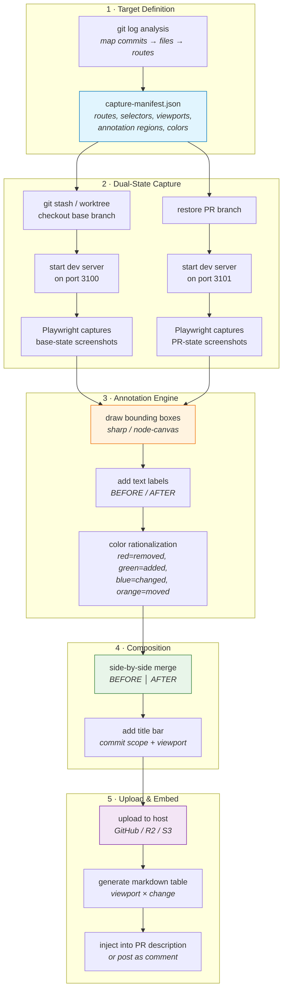
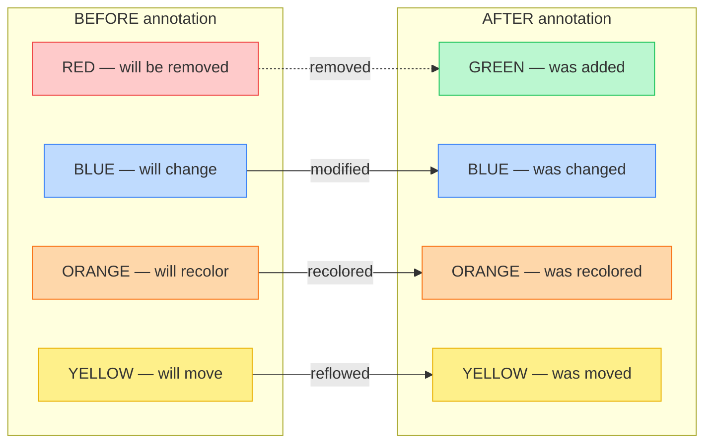
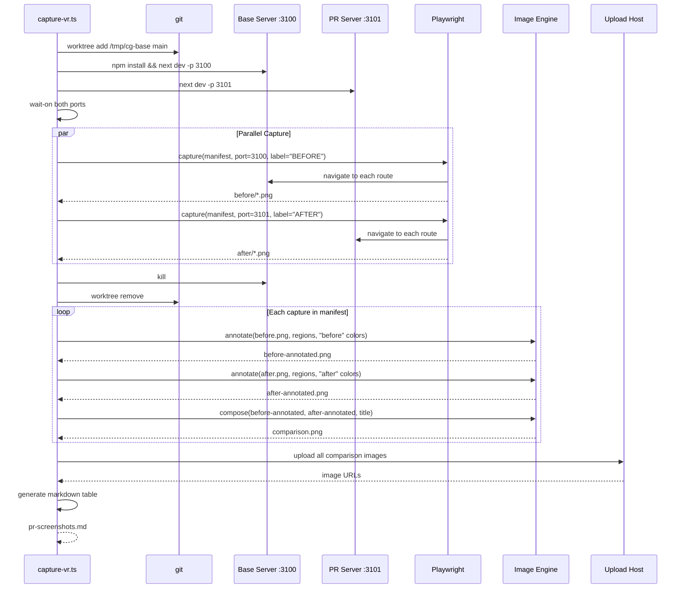
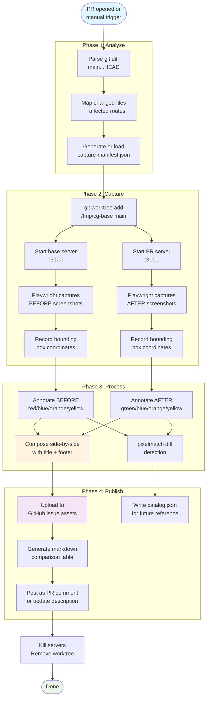

# Visual Regression Capture System

> Automated before/after screenshot generation for user-facing PR changes,
> with annotated bounding boxes and combined comparison images.

## 1. System Overview

```
┌─────────────────────────────────────────────────────────────────────┐
│                    VISUAL REGRESSION PIPELINE                       │
│                                                                     │
│  ┌──────────┐    ┌──────────┐    ┌──────────┐    ┌──────────┐      │
│  │  DEFINE   │───▶│ CAPTURE  │───▶│ ANNOTATE │───▶│ COMPOSE  │──┐   │
│  │  Targets  │    │  States  │    │  Regions │    │  Pairs   │  │   │
│  └──────────┘    └──────────┘    └──────────┘    └──────────┘  │   │
│                                                                 ▼   │
│  ┌──────────┐    ┌──────────┐    ┌──────────┐    ┌──────────┐      │
│  │  EMBED   │◀───│ UPLOAD   │◀───│ CATALOG  │◀───│ DIFF     │      │
│  │  in PR   │    │  Images  │    │  Results │    │  Detect  │      │
│  └──────────┘    └──────────┘    └──────────┘    └──────────┘      │
│                                                                     │
└─────────────────────────────────────────────────────────────────────┘
```

## 2. Architecture



## 3. Capture Manifest Schema

The manifest declares what to screenshot, where to annotate, and how to color-code.
It can be auto-generated from git diff analysis or hand-authored per commit.

```jsonc
// scripts/visual-regression/capture-manifest.json
{
  "$schema": "./capture-manifest.schema.json",
  "version": "1.0",
  "baseRef": "main",
  "prRef": "HEAD",
  "devServerPort": {
    "base": 3100,
    "pr": 3101
  },
  "viewports": [
    { "name": "mobile",  "width": 375,  "height": 812 },
    { "name": "tablet",  "width": 768,  "height": 1024 },
    { "name": "desktop", "width": 1440, "height": 900 }
  ],
  "captures": [
    {
      "id": "dropdown-chevron-padding",
      "commit": "3f89367",
      "route": "/grid-operators",
      "description": "Inner right-side padding on filter dropdowns",
      "waitFor": "table >> tr >> td",
      "regions": [
        {
          "selector": "select:first-of-type",
          "annotation": {
            "color": "blue",
            "label": "Chevron padding"
          }
        }
      ]
    },
    {
      "id": "header-spacing",
      "commit": "106f641",
      "route": "/grid-operators",
      "description": "Header height h-14 → h-12",
      "regions": [
        {
          "selector": "header",
          "annotation": {
            "color": "blue",
            "label": "h-14 → h-12"
          }
        }
      ]
    },
    {
      "id": "badge-variants",
      "commit": "111ef3f",
      "route": "/grid-operators?segment=DISTRIBUTION_COOPERATIVE",
      "description": "Badge color mapping fix",
      "waitFor": "[data-testid='data-table'] >> tr:nth-child(2)",
      "regions": [
        {
          "selector": "span:has-text('Distribution Co-op')",
          "annotation": {
            "color": "orange",
            "label": "warning → success"
          }
        }
      ]
    },
    {
      "id": "logo-redesign",
      "commit": "ecdc89b",
      "route": "/",
      "description": "G-in-C dendritic graph logo",
      "regions": [
        {
          "selector": "header a[href='/'] svg",
          "annotation": {
            "color": "green",
            "label": "New logo mark"
          }
        }
      ]
    },
    {
      "id": "changelog-tabs",
      "commit": "ea227b5",
      "route": "/changelog",
      "description": "Data Changes / Site Updates tab distinction",
      "regions": [
        {
          "selector": "button:has-text('Data Changes')",
          "annotation": {
            "color": "green",
            "label": "New tab bar"
          }
        }
      ]
    },
    {
      "id": "sort-chevrons",
      "commit": "37b1abc",
      "route": "/grid-operators",
      "description": "Sort direction ▲/▼ in dropdown labels",
      "actions": [
        { "type": "click", "selector": "[data-testid='sort-select']" }
      ],
      "regions": [
        {
          "selector": "[data-testid='sort-select']",
          "annotation": {
            "color": "blue",
            "label": "▲/▼ indicators"
          }
        }
      ]
    }
  ]
}
```

## 4. Color Rationalization System

Annotation box colors communicate the _nature_ of the visual change:

```
┌────────────────────────────────────────────────────────────────┐
│                    ANNOTATION COLOR KEY                        │
│                                                                │
│  ┌─────────┐                                                   │
│  │  RED    │  Removed — element/style that existed is gone     │
│  │ #EF4444 │  e.g., a column was deleted, a section removed    │
│  └─────────┘                                                   │
│  ┌─────────┐                                                   │
│  │  GREEN  │  Added — new element that didn't exist before     │
│  │ #22C55E │  e.g., new table column, new tab bar, new logo    │
│  └─────────┘                                                   │
│  ┌─────────┐                                                   │
│  │  BLUE   │  Modified — existing element changed in-place     │
│  │ #3B82F6 │  e.g., spacing adjusted, text changed, resized    │
│  └─────────┘                                                   │
│  ┌─────────┐                                                   │
│  │ ORANGE  │  Recolored/Remapped — visual property changed     │
│  │ #F97316 │  e.g., badge color variant, theme token swap      │
│  └─────────┘                                                   │
│  ┌─────────┐                                                   │
│  │ YELLOW  │  Moved/Reflowed — same content, different place   │
│  │ #EAB308 │  e.g., responsive stacking, layout reorder        │
│  └─────────┘                                                   │
│                                                                │
│  BEFORE images use: red, blue, orange, yellow                  │
│  AFTER images use:  green, blue, orange, yellow                │
│                                                                │
│  Rule: red on BEFORE pairs with green on AFTER for             │
│        add/remove changes. blue/orange/yellow are symmetric.   │
└────────────────────────────────────────────────────────────────┘
```



## 5. Pipeline Execution Flow

### 5.1 Dual-Server Git State Isolation

The key challenge: we need the dev server running on **both** the base and PR states
simultaneously (or sequentially) to capture screenshots against each.

**Strategy A: Sequential (simpler, slower)**

```
┌─────────────────────────────────────────────────────────┐
│  SEQUENTIAL CAPTURE                                     │
│                                                         │
│  1. git stash (save PR work)                            │
│  2. git checkout main                                   │
│  3. npm install (if deps changed)                       │
│  4. next dev --port 3100 &                              │
│  5. wait-on http://localhost:3100                        │
│  6. playwright: capture all BEFORE screenshots          │
│  7. kill dev server                                     │
│  8. git checkout - (back to PR branch)                  │
│  9. git stash pop                                       │
│  10. npm install (if deps changed)                      │
│  11. next dev --port 3100 &                             │
│  12. wait-on http://localhost:3100                       │
│  13. playwright: capture all AFTER screenshots          │
│  14. kill dev server                                    │
│  15. annotate + compose + upload                        │
│                                                         │
│  ⏱  ~3-5 min total (2 cold starts)                     │
└─────────────────────────────────────────────────────────┘
```

**Strategy B: Parallel via git worktree (faster, recommended)**

```
┌─────────────────────────────────────────────────────────┐
│  PARALLEL CAPTURE VIA WORKTREE                          │
│                                                         │
│  1. git worktree add /tmp/cg-base main                  │
│  2. cd /tmp/cg-base && npm install && next dev -p 3100 &│
│  3. cd (original) && next dev -p 3101 &                 │
│  4. wait-on http://localhost:3100                        │
│  5. wait-on http://localhost:3101                        │
│  6. playwright captures BOTH in parallel:               │
│     ├── port 3100 → BEFORE screenshots                  │
│     └── port 3101 → AFTER screenshots                   │
│  7. kill both servers                                   │
│  8. git worktree remove /tmp/cg-base                    │
│  9. annotate + compose + upload                         │
│                                                         │
│  ⏱  ~2-3 min total (parallel capture)                  │
└─────────────────────────────────────────────────────────┘
```



### 5.2 Playwright Capture Script

```
scripts/visual-regression/
├── capture-manifest.json      # What to capture (the spec)
├── capture-vr.ts              # Main orchestrator
├── playwright-capture.ts      # Playwright screenshot logic
├── annotate.ts                # Bounding box / label drawing
├── compose.ts                 # Side-by-side composition
├── upload.ts                  # Image hosting upload
└── generate-pr-table.ts       # Markdown table generator
```

**Core capture logic (pseudocode):**

```
┌─────────────────────────────────────────────────────────┐
│  playwright-capture.ts                                  │
│                                                         │
│  for each capture in manifest.captures:                 │
│    for each viewport in manifest.viewports:             │
│      1. browser.newPage()                               │
│      2. page.setViewportSize(viewport)                  │
│      3. page.goto(baseUrl + capture.route)              │
│      4. if capture.waitFor:                             │
│           page.waitForSelector(capture.waitFor)         │
│      5. if capture.actions:                             │
│           for action in capture.actions:                │
│             page[action.type](action.selector)          │
│      6. page.screenshot({ path, fullPage: false })      │
│      7. for each region in capture.regions:             │
│           element = page.locator(region.selector)       │
│           bbox = element.boundingBox()                  │
│           store bbox coordinates for annotation         │
│      8. close page                                      │
│                                                         │
│  Output: screenshots/ directory with:                   │
│    {captureId}-{viewport}-{state}.png                   │
│    {captureId}-{viewport}-{state}.regions.json          │
└─────────────────────────────────────────────────────────┘
```

### 5.3 Annotation Engine

```
┌─────────────────────────────────────────────────────────┐
│  annotate.ts                                            │
│                                                         │
│  Input:  screenshot.png + regions.json                  │
│  Output: screenshot-annotated.png                       │
│                                                         │
│  Using: sharp (fast, no native deps) or node-canvas     │
│                                                         │
│  for each region:                                       │
│    1. Parse bbox {x, y, width, height}                  │
│    2. Expand by 4px padding                             │
│    3. Draw rectangle stroke:                            │
│       - strokeWidth: 3px                                │
│       - color: region.annotation.color (from key)       │
│       - cornerRadius: 4px                               │
│       - opacity: 0.9                                    │
│    4. Draw label pill above top-left corner:            │
│       - background: same color, opacity 0.85            │
│       - text: region.annotation.label                   │
│       - font: 11px, bold, white                         │
│       - padding: 4px 8px                                │
│    5. Composite onto source image                       │
│                                                         │
│  Visual result:                                         │
│                                                         │
│    ┌─ Chevron padding ─┐                                │
│    │┌──────────────────┐│                                │
│    ││  [All Segments ▼]││ ◄── 3px blue border           │
│    │└──────────────────┘│                                │
│    └────────────────────┘                                │
│                                                         │
└─────────────────────────────────────────────────────────┘
```

### 5.4 Composition Engine

```
┌─────────────────────────────────────────────────────────┐
│  compose.ts                                             │
│                                                         │
│  Input:  before-annotated.png, after-annotated.png      │
│  Output: comparison-{id}-{viewport}.png                 │
│                                                         │
│  Layout:                                                │
│  ┌──────────────────────────────────────────────────┐   │
│  │  ░░░░░░░░░░░░░░░░ TITLE BAR ░░░░░░░░░░░░░░░░░░░│   │
│  │  "Dropdown Chevron Padding · mobile (375px)"     │   │
│  │  commit: 3f89367                                 │   │
│  ├────────────────────┬─────────────────────────────┤   │
│  │                    │                             │   │
│  │     B E F O R E    │      A F T E R              │   │
│  │                    │                             │   │
│  │  ┌──────────────┐  │  ┌──────────────┐           │   │
│  │  │ [Segments ▼] │  │  │ [Segments ▼] │           │   │
│  │  └──────────────┘  │  └──────────────┘           │   │
│  │   ▲ blue box       │   ▲ blue box                │   │
│  │                    │                             │   │
│  ├────────────────────┴─────────────────────────────┤   │
│  │  ░░ FOOTER: "BEFORE (main) │ AFTER (welcome-pr)" ░░│   │
│  └──────────────────────────────────────────────────┘   │
│                                                         │
│  Dimensions:                                            │
│    width  = before.width + after.width + divider(2px)   │
│    height = max(before, after) + title(48px) + foot(28) │
│                                                         │
│  If images differ in height:                            │
│    pad shorter one with background color at bottom      │
│                                                         │
└─────────────────────────────────────────────────────────┘
```

## 6. Image Hosting Strategy

```mermaid
graph TD
    subgraph "Option A: GitHub Issue Upload (recommended)"
        A1[Create draft issue or<br/>use existing bot issue]
        A2[POST image via<br/>GitHub GraphQL API]
        A3[Get user-content URL<br/><i>https://github.com/user-<br/>attachments/assets/UUID</i>]
        A4[URL is permanent<br/>even if issue is deleted]
        A1 --> A2 --> A3 --> A4
    end

    subgraph "Option B: Git LFS in repo"
        B1[Store in<br/>docs/screenshots/]
        B2[Track with git-lfs]
        B3[Reference via<br/>relative path]
        B1 --> B2 --> B3
    end

    subgraph "Option C: Cloud bucket"
        C1[Upload to<br/>R2 / S3 / GCS]
        C2[Public URL with<br/>content-hash filename]
        C3[Long-lived, CDN-backed]
        C1 --> C2 --> C3
    end

    subgraph "Option D: GitHub Actions Artifact"
        D1[Upload as<br/>workflow artifact]
        D2[90-day retention<br/>by default]
        D3[Not embeddable<br/>in markdown ✗]
        D1 --> D2 --> D3
    end

    style A4 fill:#e8f5e9,stroke:#2e7d32
    style D3 fill:#ffebee,stroke:#c62828
```



### Recommendation

**Option A (GitHub Issue Upload)** is the best fit because:

1. **Permanent URLs** — `github.com/user-attachments/assets/*` URLs persist indefinitely
2. **No infrastructure** — no bucket to manage, no LFS quota
3. **Automatable** — `gh api` or GraphQL mutation can upload programmatically
4. **Embeddable** — standard markdown image syntax works in PR descriptions
5. **Free** — included in GitHub's storage

**Workflow:**

```
┌──────────────────────────────────────────────────┐
│  Upload via GitHub API                           │
│                                                  │
│  1. Create (or reuse) a "Visual Regression Bot"  │
│     issue in the repo                            │
│                                                  │
│  2. For each comparison image:                   │
│     curl -X POST \                               │
│       -H "Authorization: token $GITHUB_TOKEN" \  │
│       -F "file=@comparison.png" \                │
│       https://uploads.github.com/repos/          │
│         TextureHQ/commongrid/issues/             │
│         {issue}/comments                         │
│                                                  │
│  3. Parse response for asset URL                 │
│                                                  │
│  4. Delete the comment (URL survives)            │
│     or keep for audit trail                      │
│                                                  │
│  Alternative: use gh CLI                         │
│     gh issue comment {N} --body ''      │
│                                                  │
└──────────────────────────────────────────────────┘
```

## 7. End-to-End Workflow



## 8. Output Artifacts

### 8.1 Directory Structure

```
.visual-regression/
├── captures/
│   ├── before/
│   │   ├── dropdown-chevron-padding-mobile.png
│   │   ├── dropdown-chevron-padding-mobile.regions.json
│   │   ├── dropdown-chevron-padding-tablet.png
│   │   ├── header-spacing-mobile.png
│   │   └── ...
│   ├── after/
│   │   ├── dropdown-chevron-padding-mobile.png
│   │   ├── dropdown-chevron-padding-mobile.regions.json
│   │   └── ...
│   ├── annotated/
│   │   ├── dropdown-chevron-padding-mobile-before.png
│   │   ├── dropdown-chevron-padding-mobile-after.png
│   │   └── ...
│   └── comparisons/
│       ├── dropdown-chevron-padding-mobile.png     ◄── final output
│       ├── dropdown-chevron-padding-tablet.png
│       ├── header-spacing-desktop.png
│       └── ...
├── catalog.json                                     ◄── index of all captures
└── pr-screenshots.md                                ◄── markdown embed table
```

### 8.2 Generated Markdown Table

```markdown
## Visual Regression Report

| Change | Mobile (375px) | Tablet (768px) | Desktop (1440px) |
|--------|---------------|----------------|-----------------|
| Dropdown chevron padding |  |  |  |
| Header spacing h-14→h-12 |  |  |  |
| Badge variant colors | — | — |  |
| Logo redesign |  | — |  |
| Changelog tabs | — |  |  |
| Filter stacking |  | — | — |
| Name clamping |  | — | — |

<details>
<summary>Diff detection summary</summary>

| Capture | Viewport | Pixel diff % | Status |
|---------|----------|-------------|--------|
| dropdown-chevron-padding | mobile | 2.3% | Changed |
| dropdown-chevron-padding | tablet | 1.8% | Changed |
| header-spacing | desktop | 4.1% | Changed |
| badge-variants | desktop | 3.7% | Changed |
| logo-redesign | mobile | 12.4% | Changed |
| changelog-tabs | tablet | 18.2% | New UI |

</details>
```

### 8.3 Catalog JSON

```jsonc
// .visual-regression/catalog.json
{
  "generatedAt": "2026-03-16T18:30:00Z",
  "baseRef": "main",
  "prRef": "welcome-pr",
  "prNumber": null,
  "comparisons": [
    {
      "id": "dropdown-chevron-padding",
      "commit": "3f89367",
      "description": "Inner right-side padding on filter dropdowns",
      "viewports": {
        "mobile": {
          "before": "captures/before/dropdown-chevron-padding-mobile.png",
          "after": "captures/after/dropdown-chevron-padding-mobile.png",
          "comparison": "captures/comparisons/dropdown-chevron-padding-mobile.png",
          "uploadUrl": "https://github.com/user-attachments/assets/...",
          "pixelDiffPercent": 2.3
        }
      }
    }
  ]
}
```

## 9. CLI Interface

```
Usage:
  npx tsx scripts/visual-regression/capture-vr.ts [options]

Options:
  --manifest <path>    Path to capture manifest (default: auto-detect)
  --base-ref <ref>     Base git ref to compare against (default: main)
  --viewports <list>   Comma-separated viewport names (default: all)
  --captures <list>    Comma-separated capture IDs (default: all)
  --skip-capture       Skip capture, re-annotate/compose from existing
  --skip-upload        Skip upload, just generate local files
  --upload-method      github | r2 | s3 | local (default: github)
  --output-dir <path>  Output directory (default: .visual-regression)
  --parallel           Use git worktree for parallel capture (default)
  --sequential         Use sequential checkout instead of worktree

Examples:
  # Full pipeline
  npx tsx scripts/visual-regression/capture-vr.ts

  # Just one capture at mobile
  npx tsx scripts/visual-regression/capture-vr.ts \
    --captures dropdown-chevron-padding --viewports mobile

  # Re-compose from existing screenshots (no server needed)
  npx tsx scripts/visual-regression/capture-vr.ts --skip-capture

  # Generate manifest from git diff
  npx tsx scripts/visual-regression/generate-manifest.ts
```

## 10. Integration Points

### 10.1 GitHub Actions Workflow

```yaml
# .github/workflows/visual-regression.yml
name: Visual Regression
on:
  pull_request:
    types: [opened, synchronize]

jobs:
  capture:
    runs-on: ubuntu-latest
    steps:
      - uses: actions/checkout@v4
        with:
          fetch-depth: 0  # full history for worktree

      - uses: actions/setup-node@v4
        with:
          node-version: 20

      - run: npm ci
      - run: npx playwright install chromium

      - name: Capture visual regression
        run: npx tsx scripts/visual-regression/capture-vr.ts
        env:
          GITHUB_TOKEN: ${{ secrets.GITHUB_TOKEN }}

      - name: Post comparison images
        uses: actions/github-script@v7
        with:
          script: |
            const fs = require('fs');
            const table = fs.readFileSync('.visual-regression/pr-screenshots.md', 'utf8');
            await github.rest.issues.createComment({
              owner: context.repo.owner,
              repo: context.repo.repo,
              issue_number: context.issue.number,
              body: table,
            });
```

### 10.2 PR Template Integration

The generated `pr-screenshots.md` can be spliced into the Screenshots section
of `PR_DESCRIPTION.md` during the upload phase, or posted as a separate PR comment
that auto-updates on each push.

### 10.3 Manual Trigger

```bash
# From repo root, with PR branch checked out:
npm run vr:capture

# Add to package.json scripts:
# "vr:capture": "tsx scripts/visual-regression/capture-vr.ts",
# "vr:manifest": "tsx scripts/visual-regression/generate-manifest.ts"
```

## 11. File-to-Route Mapping

For auto-generating the manifest from `git diff`, the system needs to know
which files affect which routes:

```jsonc
// scripts/visual-regression/file-route-map.json
{
  "app/(shell)/grid-operators/page.tsx": ["/grid-operators"],
  "app/(shell)/power-plants/page.tsx": ["/power-plants"],
  "app/(shell)/transmission-lines/page.tsx": ["/transmission-lines"],
  "app/(shell)/ev-charging/page.tsx": ["/ev-charging"],
  "app/(shell)/pricing-nodes/page.tsx": ["/pricing-nodes"],
  "app/(shell)/changelog/page.tsx": ["/changelog"],
  "app/(shell)/explore/page.tsx": ["/explore"],
  "app/(shell)/about/page.tsx": ["/about"],
  "app/(shell)/page.tsx": ["/"],
  "components/TopBar.tsx": ["*"],
  "components/ShellLayoutClient.tsx": ["*"],
  "components/GlobalSearch.tsx": ["*"],
  "components/SearchInput.tsx": ["/grid-operators", "/power-plants", "/transmission-lines", "/ev-charging", "/pricing-nodes"],
  "components/DataSourceLink.tsx": ["/grid-operators", "/power-plants", "/transmission-lines", "/ev-charging", "/pricing-nodes"],
  "components/explorer/*": ["/explore"],
  "lib/formatting.ts": ["/grid-operators", "/explore"],
  "lib/geo.ts": ["/explore", "/grid-operators/*"],
  "app/globals.css": ["*"],
  "public/logo.svg": ["*"],
  "public/favicon.svg": ["*"]
}
```

`"*"` means the change affects all routes — capture a representative sample.

## 12. Concrete Implementation Reference

### 12.1 Playwright Capture — Actual API

```typescript
// playwright-capture.ts
import { chromium, type Page, type BrowserContext } from 'playwright';

interface CaptureResult {
  path: string;
  regions: Array<{ selector: string; bbox: { x: number; y: number; width: number; height: number } }>;
}

async function captureRoute(
  context: BrowserContext,
  baseUrl: string,
  capture: ManifestCapture,
  viewport: { name: string; width: number; height: number },
  outputDir: string,
): Promise<CaptureResult> {
  const page = await context.newPage();
  await page.setViewportSize({ width: viewport.width, height: viewport.height });

  // Navigate and wait for content
  await page.goto(`${baseUrl}${capture.route}`, { waitUntil: 'networkidle' });
  if (capture.waitFor) {
    await page.waitForSelector(capture.waitFor, { timeout: 10_000 });
  }

  // Disable animations for deterministic capture
  await page.addStyleTag({ content: `
    *, *::before, *::after {
      animation-duration: 0s !important;
      transition-duration: 0s !important;
    }
  `});

  // Execute pre-capture actions (click dropdowns, hover, etc.)
  if (capture.actions) {
    for (const action of capture.actions) {
      await page.locator(action.selector)[action.type as 'click']();
      await page.waitForTimeout(200);
    }
  }

  // Capture full viewport screenshot
  const screenshotPath = `${outputDir}/${capture.id}-${viewport.name}.png`;
  await page.screenshot({ path: screenshotPath, fullPage: false });

  // Record bounding boxes for each annotatable region
  const regions = [];
  for (const region of capture.regions) {
    const locator = page.locator(region.selector).first();
    const bbox = await locator.boundingBox();
    if (bbox) {
      regions.push({ selector: region.selector, bbox, annotation: region.annotation });
    }
  }

  await page.close();
  return { path: screenshotPath, regions };
}
```

### 12.2 Annotation — sharp + SVG Compositing

```typescript
// annotate.ts
import sharp from 'sharp';

const COLORS = {
  red:    { stroke: '#EF4444', fill: 'rgba(239,68,68,0.85)' },
  green:  { stroke: '#22C55E', fill: 'rgba(34,197,94,0.85)' },
  blue:   { stroke: '#3B82F6', fill: 'rgba(59,130,246,0.85)' },
  orange: { stroke: '#F97316', fill: 'rgba(249,115,22,0.85)' },
  yellow: { stroke: '#EAB308', fill: 'rgba(234,179,8,0.85)' },
};

interface AnnotationRegion {
  bbox: { x: number; y: number; width: number; height: number };
  annotation: { color: keyof typeof COLORS; label: string };
}

async function annotateImage(
  inputPath: string,
  regions: AnnotationRegion[],
  outputPath: string,
): Promise<void> {
  const meta = await sharp(inputPath).metadata();
  const { width = 0, height = 0 } = meta;

  // Build SVG overlay with all bounding boxes and labels
  const boxes = regions.map((r) => {
    const c = COLORS[r.annotation.color];
    const pad = 4;
    const x = Math.max(0, r.bbox.x - pad);
    const y = Math.max(0, r.bbox.y - pad);
    const w = r.bbox.width + pad * 2;
    const h = r.bbox.height + pad * 2;
    const labelW = r.annotation.label.length * 7 + 16;
    const labelH = 20;
    const labelY = Math.max(0, y - labelH - 2);

    return `
      <rect x="${x}" y="${y}" width="${w}" height="${h}"
            fill="none" stroke="${c.stroke}" stroke-width="3" rx="4"/>
      <rect x="${x}" y="${labelY}" width="${labelW}" height="${labelH}"
            fill="${c.fill}" rx="3"/>
      <text x="${x + 8}" y="${labelY + 14}"
            font-size="11" font-weight="bold" fill="white"
            font-family="system-ui, sans-serif">${r.annotation.label}</text>
    `;
  }).join('');

  const svgOverlay = Buffer.from(
    `<svg width="${width}" height="${height}" xmlns="http://www.w3.org/2000/svg">${boxes}</svg>`
  );

  await sharp(inputPath)
    .composite([{ input: svgOverlay, top: 0, left: 0 }])
    .toFile(outputPath);
}
```

### 12.3 Composition — Side-by-Side with Title Bar

```typescript
// compose.ts
import sharp from 'sharp';

async function composePair(
  beforePath: string,
  afterPath: string,
  title: string,
  outputPath: string,
): Promise<void> {
  const [bMeta, aMeta] = await Promise.all([
    sharp(beforePath).metadata(),
    sharp(afterPath).metadata(),
  ]);

  const bW = bMeta.width ?? 0;
  const aW = aMeta.width ?? 0;
  const maxH = Math.max(bMeta.height ?? 0, aMeta.height ?? 0);
  const divider = 2;
  const titleH = 48;
  const footerH = 28;
  const totalW = bW + aW + divider;
  const totalH = maxH + titleH + footerH;

  const titleSvg = `
    <svg width="${totalW}" height="${titleH}">
      <rect width="100%" height="100%" fill="#f8f9fb"/>
      <text x="${totalW / 2}" y="30" text-anchor="middle"
            font-size="14" font-weight="600" fill="#1f2937"
            font-family="system-ui, sans-serif">${title}</text>
    </svg>`;

  const footerSvg = `
    <svg width="${totalW}" height="${footerH}">
      <rect width="100%" height="100%" fill="#f1f5f9"/>
      <text x="${bW / 2}" y="18" text-anchor="middle"
            font-size="11" fill="#64748b"
            font-family="system-ui, sans-serif">BEFORE (main)</text>
      <line x1="${bW + 1}" y1="4" x2="${bW + 1}" y2="24"
            stroke="#cbd5e1" stroke-width="1"/>
      <text x="${bW + divider + aW / 2}" y="18" text-anchor="middle"
            font-size="11" fill="#64748b"
            font-family="system-ui, sans-serif">AFTER (PR)</text>
    </svg>`;

  // Divider line
  const dividerBuf = await sharp({
    create: { width: divider, height: maxH, channels: 4,
              background: { r: 203, g: 213, b: 225, alpha: 1 } },
  }).png().toBuffer();

  await sharp({
    create: { width: totalW, height: totalH, channels: 4,
              background: { r: 255, g: 255, b: 255, alpha: 1 } },
  })
    .composite([
      { input: Buffer.from(titleSvg), top: 0, left: 0 },
      { input: await sharp(beforePath).toBuffer(), top: titleH, left: 0 },
      { input: dividerBuf, top: titleH, left: bW },
      { input: await sharp(afterPath).toBuffer(), top: titleH, left: bW + divider },
      { input: Buffer.from(footerSvg), top: titleH + maxH, left: 0 },
    ])
    .toFile(outputPath);
}
```

### 12.4 Diff Detection — pixelmatch

```typescript
// diff.ts
import { PNG } from 'pngjs';
import pixelmatch from 'pixelmatch';
import fs from 'fs';

interface DiffResult {
  diffPixels: number;
  totalPixels: number;
  diffPercent: number;
  diffImagePath: string;
}

function computeDiff(beforePath: string, afterPath: string, diffPath: string): DiffResult {
  const img1 = PNG.sync.read(fs.readFileSync(beforePath));
  const img2 = PNG.sync.read(fs.readFileSync(afterPath));

  // Images must be same dimensions — pad smaller if needed
  const width = Math.max(img1.width, img2.width);
  const height = Math.max(img1.height, img2.height);
  const diff = new PNG({ width, height });

  const diffPixels = pixelmatch(
    img1.data, img2.data, diff.data, width, height,
    { threshold: 0.1, includeAA: false }
  );

  fs.writeFileSync(diffPath, PNG.sync.write(diff));

  const totalPixels = width * height;
  return {
    diffPixels,
    totalPixels,
    diffPercent: Number(((diffPixels / totalPixels) * 100).toFixed(2)),
    diffImagePath: diffPath,
  };
}
```

### 12.5 Upload — GitHub Branch Storage

Research confirmed GitHub's API does not support direct image uploads to comments.
The most durable strategy is **pushing images to a dedicated branch** and referencing
via raw GitHub URLs. This is the approach used by `opengisch/comment-pr-with-images`.

```typescript
// upload.ts
import { execSync } from 'child_process';

function uploadToGitHubBranch(
  imagePaths: string[],
  branch = 'visual-regression-assets',
  subdir = 'comparisons',
): Map<string, string> {
  const repo = 'TextureHQ/commongrid';
  const urls = new Map<string, string>();

  // Create orphan branch if it doesn't exist
  try {
    execSync(`git rev-parse --verify ${branch}`, { stdio: 'ignore' });
  } catch {
    execSync(`git checkout --orphan ${branch}`);
    execSync('git rm -rf . 2>/dev/null || true');
    execSync('git commit --allow-empty -m "init visual regression assets"');
    execSync(`git checkout -`);
  }

  // Use worktree to add images without switching branches
  const worktreePath = '/tmp/vr-upload';
  execSync(`git worktree add ${worktreePath} ${branch} 2>/dev/null || true`);

  for (const imgPath of imagePaths) {
    const filename = imgPath.split('/').pop()!;
    execSync(`mkdir -p ${worktreePath}/${subdir}`);
    execSync(`cp ${imgPath} ${worktreePath}/${subdir}/${filename}`);
    urls.set(
      imgPath,
      `https://raw.githubusercontent.com/${repo}/${branch}/${subdir}/${filename}`,
    );
  }

  execSync(`cd ${worktreePath} && git add -A && git commit -m "VR: update comparison images" && git push origin ${branch}`, { stdio: 'inherit' });
  execSync(`git worktree remove ${worktreePath}`);

  return urls;
}
```

Alternative: use [CML](https://cml.dev) (`cml comment create`) which handles
image embedding in PR comments automatically, or [imgbb](https://api.imgbb.com/)
for zero-infrastructure external hosting.

## 13. Existing Open-Source Visual Regression Tools

### Landscape Comparison

```
┌──────────────────────────────────────────────────────────────────────────┐
│                  VISUAL REGRESSION TOOL LANDSCAPE                       │
│                                                                          │
│  ┌──────────────┐  ┌──────────────┐  ┌──────────────┐  ┌─────────────┐  │
│  │  Lost Pixel  │  │  Argos CI    │  │   Chromatic  │  │   Percy     │  │
│  │  ───────────  │  │  ──────────  │  │  ──────────  │  │  ─────────  │  │
│  │  OSS / Free  │  │  OSS / Free  │  │  Freemium   │  │  SaaS only  │  │
│  │  odiff (6x   │  │  Playwright  │  │  Storybook  │  │  DOM snap-  │  │
│  │  faster diff) │  │  Cypress     │  │  deep integ │  │  shot based │  │
│  │  Storybook + │  │  Puppeteer   │  │  TurboSnap  │  │  Multi-     │  │
│  │  Page + PW   │  │  CI comments │  │  Cloud UI   │  │  browser    │  │
│  │  Git baselines│  │  Anim freeze│  │  Review UI  │  │  rendering  │  │
│  └──────────────┘  └──────────────┘  └──────────────┘  └─────────────┘  │
│        ▲                  ▲                                               │
│        │                  │                                               │
│   Best fit for       Good for                                            │
│   agentic / CI      complex apps                                         │
│   lightweight       with animations                                      │
│                                                                          │
│  ┌──────────────┐  ┌──────────────┐  ┌──────────────┐                    │
│  │  Playwright  │  │  BackstopJS  │  │  reg-suit    │                    │
│  │  built-in    │  │  ───────────  │  │  ──────────  │                    │
│  │  ───────────  │  │  Puppeteer   │  │  S3 + GitHub │                    │
│  │  toHaveScr.. │  │  Config-     │  │  Plugin      │                    │
│  │  pixelmatch  │  │  driven      │  │  architecture│                    │
│  │  Zero extra  │  │  Scenarios   │  │  Notify PR   │                    │
│  │  deps needed │  │  Docker ref  │  │  via comment │                    │
│  └──────────────┘  └──────────────┘  └──────────────┘                    │
│        ▲                                                                 │
│        │                                                                 │
│   Simplest start                                                         │
│   (already a dep)                                                        │
└──────────────────────────────────────────────────────────────────────────┘
```

### Recommendation Matrix

| Criterion | Lost Pixel | Playwright built-in | Argos CI | Custom (this spec) |
|-----------|-----------|-------------------|----------|-------------------|
| **Open source** | Yes | Yes | Yes | Yes |
| **Dependency weight** | odiff-bin + config | Zero (already in PW) | CLI + service | sharp + pixelmatch |
| **Agentic-friendly** | Config-driven JSON | Test file per route | Config-driven | Manifest-driven |
| **Annotation/bbox** | No | No | Diff overlay only | **Yes — full control** |
| **Before/after compose** | Diff overlay | 3-panel (expected/actual/diff) | Cloud UI | **Custom side-by-side** |
| **PR integration** | GitHub Action comment | Test report artifact | PR comment | **Custom markdown table** |
| **Learning curve** | Low | Very low | Low | Medium |
| **Color-coded annotations** | No | No | No | **Yes** |
| **Selective capture** | Stories/pages | Test-scoped | Stories/pages | **Per-commit manifest** |

### Recommendation

**For CommonGrid specifically:**

1. **Start with Playwright built-in** (`toHaveScreenshot`) for pure regression detection — zero new deps, catches unintended changes
2. **Layer the custom system** (this spec) on top for PR-quality annotated comparison images — the bounding-box + color-coding + composition pipeline doesn't exist in any off-the-shelf tool
3. **Consider Lost Pixel** if Storybook is ever adopted — it's the most lightweight OSS option with the fastest diff engine (odiff)

The custom system fills a gap no existing tool covers: **per-commit, color-rationalized, annotated before/after comparison images** that communicate _what_ changed and _why_ at a glance in a PR description.

## 14. Dependencies

```
# Core (all devDependencies)
playwright          — browser automation + screenshots (may already be installed)
sharp               — image annotation via SVG compositing (no native canvas dep)
pixelmatch          — pixel-level diff detection (~150 lines, zero deps)
pngjs               — PNG encode/decode for pixelmatch
wait-on             — wait for dev server to be ready before capture

# Optional
join-images         — simplified side-by-side composition (built on sharp)
odiff-bin           — 6x faster diff than pixelmatch (OCaml binary, optional upgrade)
```

Total footprint: ~3MB added to devDependencies. No runtime impact.
