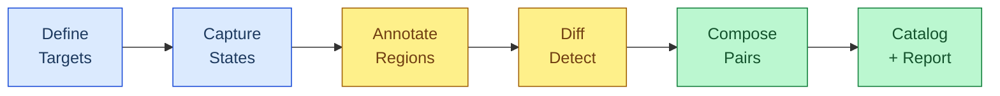
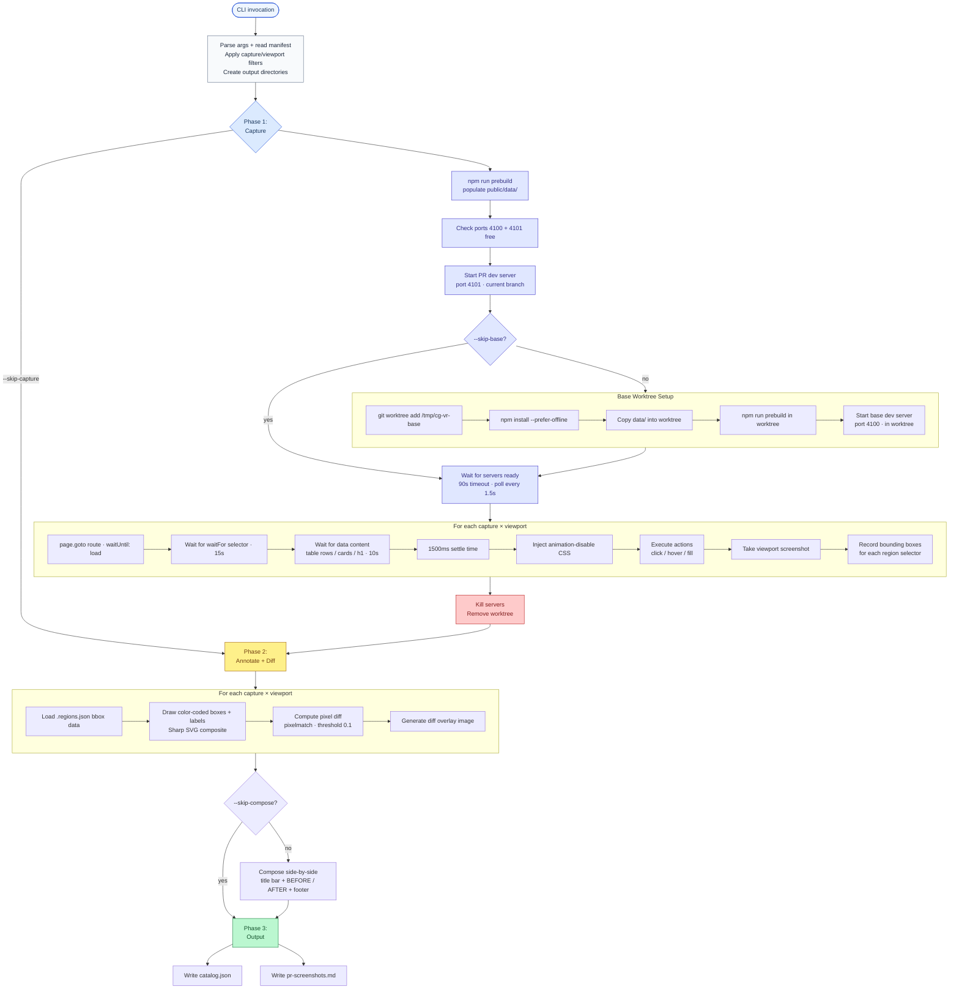

# Visual Regression Capture System

> Automated before/after screenshot pipeline for PR review.
> Captures two states of a running app via git worktree isolation,
> annotates regions of interest, computes pixel diffs, and composes
> side-by-side comparison images with a markdown report.

## Quick Start

```bash
# Full pipeline: base (worktree) + PR screenshots, annotate, diff, compose
npm run vr:capture

# PR-only: skip base screenshots (use existing ones from a prior run)
npm run vr:capture:pr-only

# Cherry-pick specific captures and viewports
npx tsx scripts/visual-regression/capture-vr.ts \
  --captures logo-redesign,header-spacing \
  --viewports desktop

# Re-process existing screenshots (skip Playwright, re-annotate + compose)
npx tsx scripts/visual-regression/capture-vr.ts --skip-capture
```

## How It Works



The pipeline runs in three phases:

1. **Capture** — Playwright takes viewport-sized screenshots of each route on two parallel dev servers (base branch via git worktree on port 4100, PR branch on port 4101). Bounding box coordinates for annotated regions are recorded alongside each screenshot.
2. **Annotate + Diff** — Sharp draws color-coded bounding boxes onto the raw screenshots. Pixelmatch compares before/after pairs and calculates a pixel-diff percentage.
3. **Compose + Report** — Annotated images are combined into titled side-by-side comparison PNGs. A `catalog.json` and `pr-screenshots.md` markdown report are generated.

Each phase is independently skippable via CLI flags.

---

## Execution Flow (Detailed)



### Playwright Wait Cascade

```mermaid
flowchart LR
    NAV[page.goto<br>waitUntil: load] --> WF{waitFor<br>selector?}
    WF -- yes --> WFS[Wait 15s<br>for selector]
    WF -- no --> DATA
    WFS --> DATA[Wait 10s for<br>data content]
    DATA --> SETTLE[1500ms<br>settle]
    SETTLE --> CSS[Inject<br>no-animation CSS]
    CSS --> ACT{actions<br>defined?}
    ACT -- yes --> EXEC[Execute each<br>+ 300ms settle]
    ACT -- no --> SNAP
    EXEC --> SNAP[Screenshot<br>+ bbox record]

    style NAV fill:#dbeafe,stroke:#1d4ed8,color:#1e3a5f
    style WF fill:#fef08a,stroke:#a16207,color:#713f12
    style WFS fill:#e0e7ff,stroke:#4338ca,color:#312e81
    style DATA fill:#e0e7ff,stroke:#4338ca,color:#312e81
    style SETTLE fill:#e0e7ff,stroke:#4338ca,color:#312e81
    style CSS fill:#fecaca,stroke:#b91c1c,color:#7f1d1d
    style ACT fill:#fef08a,stroke:#a16207,color:#713f12
    style EXEC fill:#e0e7ff,stroke:#4338ca,color:#312e81
    style SNAP fill:#bbf7d0,stroke:#15803d,color:#14532d
```



---

## CLI Reference

```
npx tsx scripts/visual-regression/capture-vr.ts [options]
```

| Flag | Default | Description |
|------|---------|-------------|
| `--base-ref <ref>` | `main` | Git ref for baseline screenshots |
| `--captures <id,id,...>` | all | Comma-separated capture IDs to run |
| `--viewports <vp,vp,...>` | all | Comma-separated viewport names to run |
| `--skip-capture` | off | Skip Playwright phase; re-process existing screenshots |
| `--skip-base` | off | Skip base worktree + server; only capture PR state |
| `--skip-compose` | off | Skip side-by-side composition; just capture + annotate |
| `--output <dir>` | `.visual-regression` | Output directory (relative to repo root) |

**npm aliases:**
- `npm run vr:capture` — full pipeline
- `npm run vr:capture:pr-only` — equivalent to `--skip-base`

---

## File Structure

```
scripts/visual-regression/
├── capture-vr.ts            # Main orchestrator (args, servers, worktree, phases)
├── playwright-capture.ts    # Headless Chromium: navigate, wait, screenshot, bbox
├── annotate.ts              # Sharp SVG composite: bounding boxes + labels
├── compose.ts               # Sharp: side-by-side comparison images
├── diff.ts                  # Pixelmatch: pixel-level diff + overlay
├── capture-manifest.json    # Capture definitions (routes, regions, viewports)
└── file-route-map.json      # Maps source files → affected routes (for authoring)

.visual-regression/          # Output (gitignored)
├── captures/
│   ├── before/              # Raw + .regions.json from base branch
│   ├── after/               # Raw + .regions.json from PR branch
│   ├── annotated/           # Screenshots with bounding box overlays
│   ├── comparisons/         # Side-by-side titled composition images
│   └── diffs/               # Pixel diff overlay images
├── catalog.json             # Machine-readable results
└── pr-screenshots.md        # Human-readable markdown report
```

---

## Capture Manifest

The manifest (`scripts/visual-regression/capture-manifest.json`) defines what to capture and how.

### Top-level structure

```jsonc
{
  "version": "1.0",
  "baseRef": "main",              // default base branch
  "prRef": "HEAD",                // current branch
  "devServer": {
    "command": "npx next dev",    // dev server command
    "readyPattern": "Ready in",   // stdout pattern indicating ready
    "basePort": 4100,             // port for base branch server
    "prPort": 4101                // port for PR branch server
  },
  "viewports": [                  // available viewport sizes
    { "name": "mobile",  "width": 375,  "height": 812  },
    { "name": "tablet",  "width": 768,  "height": 1024 },
    { "name": "desktop", "width": 1440, "height": 900  }
  ],
  "captures": [ ... ]            // see below
}
```

### Capture entry

```jsonc
{
  "id": "badge-variants",                    // unique identifier (used in filenames)
  "commit": "111ef3f",                       // optional: originating commit for traceability
  "route": "/grid-operators",                // URL path to navigate to
  "description": "Badge color mapping fix",  // human-readable title for composition

  // Optional: restrict to specific viewports (default: all)
  "viewports": ["desktop"],

  // Optional: CSS selector to wait for before capturing (15s timeout)
  "waitFor": "main",

  // Optional: pre-capture interactions
  "actions": [
    { "type": "click", "selector": "header button[aria-label='Toggle menu']" },
    { "type": "hover", "selector": ".tooltip-trigger" },
    { "type": "fill",  "selector": "input[name='search']", "value": "test" }
  ],

  // Regions to annotate with bounding boxes
  "regions": [
    {
      "selector": "table tbody tr:nth-child(1) td:nth-child(2) span",
      "beforeColor": "orange",   // color on BEFORE screenshot
      "afterColor": "orange",    // color on AFTER screenshot
      "label": "Badge variant"   // label text drawn above the box
    }
  ]
}
```

### Region color semantics

| Color | Hex | Meaning | Typical usage |
|-------|-----|---------|---------------|
| `red` | `#EF4444` | Removed | Element only in BEFORE (beforeColor: red, afterColor: green) |
| `green` | `#22C55E` | Added | Element only in AFTER (beforeColor: red, afterColor: green) |
| `blue` | `#3B82F6` | Modified in-place | Same element, changed styling/content |
| `orange` | `#F97316` | Recolored/remapped | Color or visual mapping changed |
| `yellow` | `#EAB308` | Moved/reflowed | Element position shifted |

Use symmetric colors (same before/after) for in-place changes. Use asymmetric (red/green) for additions/removals.

---

## Module Reference

### `capture-vr.ts` — Orchestrator

The main entry point. Parses CLI args, manages server lifecycle and git worktree, then sequences the three phases. All cleanup (server kill, worktree removal) runs in `finally` blocks.

Key behaviors:
- **Port check**: Fetches `http://localhost:<port>` before starting servers. If a response comes back, the port is occupied and the script aborts with an actionable error.
- **Server wait**: Polls every 1.5s for up to 90s. Accepts HTTP 200 as ready. Accepts HTTP 404 after timeout (route may not exist on base).
- **Worktree**: Created at `/tmp/cg-vr-base`. Installs deps, copies `data/`, runs prebuild. Force-removed on cleanup.

### `playwright-capture.ts` — Screenshot Engine

Launches headless Chromium and iterates captures × viewports. For each:

1. Creates a fresh browser context with exact viewport dimensions, 1x scale, light color scheme
2. Navigates with `waitUntil: "load"` (not `networkidle`, which hangs on long-poll connections)
3. Waits for content readiness via a cascade:
   - Explicit `waitFor` selector (15s)
   - Generic data-content selector: `[class*="DataTable"] [role="row"], table tr, [class*="Card"], main h1` (10s)
   - 1500ms settle time
4. Injects animation-disable CSS (`animation-duration: 0s`, `transition-duration: 0s`)
5. Executes optional `actions` (click, hover, fill) with 300ms settle after each
6. Takes a viewport-sized screenshot (not full-page)
7. Records bounding boxes (`element.boundingBox()`) for each region selector
8. Writes `{id}-{viewport}.png` and `{id}-{viewport}.regions.json`

### `annotate.ts` — Bounding Box Renderer

Uses Sharp's SVG composite to overlay annotations without a native Canvas dependency.

For each region:
- Draws a rounded-corner rectangle (3px stroke, 4px padding) in the region's color
- Draws a pill-shaped label background above the box
- Renders label text in white, 11px bold system font

If no regions have bounding boxes, copies the image as-is.

### `diff.ts` — Pixel Diff Engine

Wraps `pixelmatch` (same library Playwright uses internally):
- Reads both PNGs via `pngjs`
- Pads the smaller image to match dimensions (transparent fill)
- Runs diff with threshold 0.1, `includeAA: false`
- Returns `{ diffPixels, totalPixels, diffPercent }` and writes a diff overlay PNG

### `compose.ts` — Side-by-Side Composition

Creates a single comparison image via Sharp:

```
┌──────────────────────────────────────────┐
│  Title bar (48px) — description · viewport
├───────────────────┬──────────────────────┤
│                   │                      │
│     BEFORE        │      AFTER           │
│                   │                      │
├───────────────────┴──────────────────────┤
│  Footer (28px) — "BEFORE (main)" │ "AFTER (PR)"
└──────────────────────────────────────────┘
```

Divider is 2px. Title and footer use SVG text rendering with system fonts.

---

## File-Route Map

`file-route-map.json` maps source files to the routes they affect. This is a reference for authoring new capture entries — when a commit touches `components/TopBar.tsx`, the `"*"` mapping tells you every route is potentially affected.

```json
{
  "app/(shell)/grid-operators/page.tsx": ["/grid-operators"],
  "components/TopBar.tsx": ["*"],
  "public/logo.svg": ["*"]
}
```

Use `git diff --name-only main...HEAD` to find changed files, then look them up here to determine which routes need captures.

---

## Output Artifacts

### `catalog.json`

```json
{
  "generatedAt": "2025-03-15T...",
  "baseRef": "main",
  "prRef": "HEAD",
  "comparisons": [
    {
      "id": "header-spacing",
      "commit": "106f641",
      "description": "Header height h-14 → h-12",
      "viewports": {
        "desktop": {
          "before": "captures/annotated/header-spacing-desktop-before.png",
          "after":  "captures/annotated/header-spacing-desktop-after.png",
          "comparison": "captures/comparisons/header-spacing-desktop.png",
          "diffPercent": 3.41
        }
      }
    }
  ]
}
```

### `pr-screenshots.md`

A markdown report with tables of all comparisons and their diff percentages, suitable for pasting into PR descriptions.

---

## Dependencies

| Package | Role |
|---------|------|
| `playwright` | Headless Chromium automation |
| `sharp` | Fast PNG composition and SVG overlay (no native canvas) |
| `pixelmatch` | Pixel-level image comparison |
| `pngjs` | PNG read/write for pixelmatch |
| `tsx` | TypeScript execution without build step |

---

## Adapting for Other Projects

This system is generic. To use it in a different Next.js (or any dev-server) project:

1. **Copy `scripts/visual-regression/`** into your project
2. **Edit `capture-manifest.json`**:
   - Set `devServer.command` to your dev server start command
   - Set `devServer.readyPattern` to the stdout string your server prints when ready
   - Adjust ports if 4100/4101 conflict
   - Define your `viewports`
   - Author `captures` entries for the routes and regions you care about
3. **Add npm scripts** to `package.json`:
   ```json
   "vr:capture": "npx tsx scripts/visual-regression/capture-vr.ts",
   "vr:capture:pr-only": "npx tsx scripts/visual-regression/capture-vr.ts --skip-base"
   ```
4. **Add `.visual-regression/` to `.gitignore`**
5. If your project has a prebuild step that populates public assets, ensure the `createWorktree` function in `capture-vr.ts` calls it (it currently runs `npm run prebuild`)

### Non-Next.js projects

The only Next.js-specific assumptions are:
- `npx next dev -p <port>` as the dev server command (configurable in manifest)
- `npm run prebuild` for data file population (edit `createWorktree` if not needed)
- The content-readiness selector in `playwright-capture.ts` uses `[class*="DataTable"]` etc. — adjust to match your app's DOM patterns

Everything else (worktree strategy, annotation, diffing, composition) is framework-agnostic.
